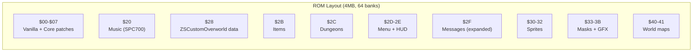
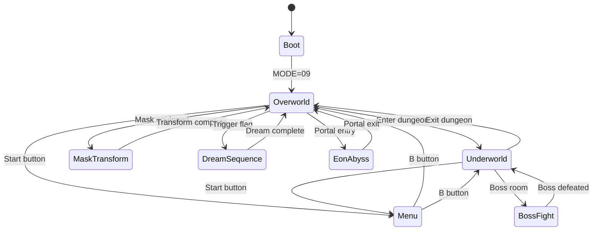
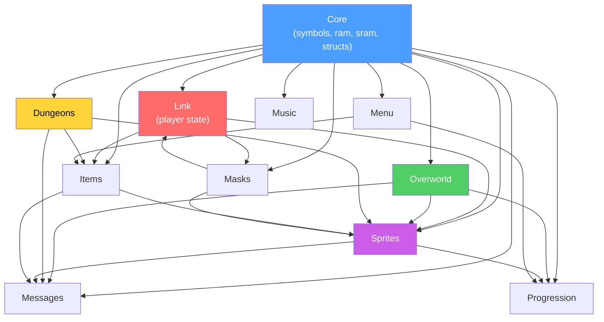
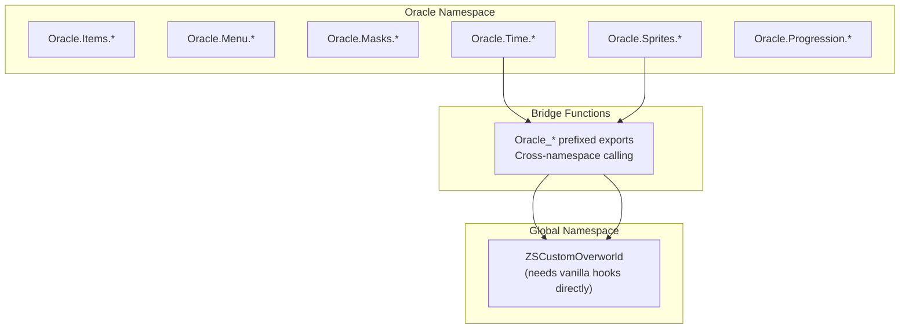

# Oracle of Secrets — System Architecture

**Generated:** 2026-03-21
**Scope:** Complete system overview with bank allocation, module dependencies, and build pipeline.

---

## High-Level Architecture

```mermaid
graph TB
    subgraph "Build Pipeline"
        BASE["oos168.sfc<br/>(Unpatched Base ROM)"]
        ASAR["Asar Assembler"]
        PATCHED["oos168x.sfc<br/>(Patched ROM)"]
        BASE --> ASAR --> PATCHED
    end

    subgraph "Entry Points"
        MAIN["Oracle_main.asm"]
    end

    MAIN --> ASAR

    subgraph "Core Systems (Bank $00-$07)"
        HW["hardware.asm<br/>SNES hardware defs"]
        RAM["ram.asm (217KB)<br/>WRAM declarations"]
        SRAM["sram.asm (28KB)<br/>Save data layout"]
        SYM["symbols.asm<br/>Global symbols"]
        TBL["tables.asm<br/>Lookup tables"]
        STRUCT["structs.asm<br/>Data structures"]
        LINK["link.asm<br/>Player state machine"]
        MSG["message.asm (76KB)<br/>Dialogue engine"]
        PROG["progression.asm<br/>Quest state helpers"]
        PATCH["patches.asm<br/>Vanilla ROM patches"]
    end

    subgraph "Game Modules"
        MUSIC["Music (Bank $20)<br/>SPC700 tracks"]
        OW["Overworld (Bank $28, $40-41)<br/>ZSCustomOverworld"]
        ITEMS["Items (Bank $2B)<br/>Hookshot, Ocarina, etc."]
        DNG["Dungeons (Bank $2C)<br/>Room logic, collision"]
        MENU["Menu (Bank $2D-2E)<br/>HUD, journal, items"]
        SPR["Sprites (Bank $30-32)<br/>NPCs, enemies, bosses"]
        MASKS["Masks (Bank $33-3B)<br/>Deku, Zora, Wolf, etc."]
    end

    subgraph "Config"
        FF["feature_flags.asm<br/>Runtime feature gates"]
        MF["module_flags.asm<br/>Module isolation toggles"]
    end

    subgraph "Tooling"
        BUILD["build_rom.sh"]
        OVERLAP["check_zscream_overlap.py"]
        HOOKS["generate_hooks_json.py"]
        CAMPAIGN["campaign/ harness"]
        MESEN["Mesen2 debug client"]
        TESTS["test_runner.py<br/>regression suite"]
    end

    MAIN --> HW & RAM & SRAM & SYM
    MAIN --> MUSIC & OW & ITEMS & DNG & MENU & SPR & MASKS
    FF --> MAIN
    MF --> MAIN
    BUILD --> ASAR
    BUILD --> HOOKS
    PATCHED --> MESEN
    PATCHED --> TESTS
```

---

## ROM Bank Allocation

| Bank | Range | Module | Primary File | Size |
|------|-------|--------|-------------|------|
| $00-$07 | $008000-$07FFFF | Core / Vanilla | `Core/*.asm`, `link.asm` | Shared |
| $20 | $208000-$20FFFF | Music | `Music/all_music.asm` | 32KB |
| $28 | $288000-$28FFFF | Overworld | `Overworld/ZSCustomOverworld.asm` | 32KB |
| $2B | $2B8000-$2BFFFF | Items | `Items/all_items.asm` | 32KB |
| $2C | $2C8000-$2CFFFF | Dungeons | `Dungeons/dungeons.asm` | 32KB |
| $2D-$2E | $2D8000-$2EFFFF | Menu + HUD | `Menu/menu.asm` | 64KB |
| $2F | $2F8000-$2FFFFF | Messages | `Core/message.asm` | 32KB |
| $30-$32 | $308000-$32FFFF | Sprites | `Sprites/all_sprites.asm` | 96KB |
| $33-$3B | $338000-$3BFFFF | Masks + GFX | `Masks/all_masks.asm` | 288KB |
| $40-$41 | $408000-$41FFFF | World maps | `Overworld/overworld.asm` | 64KB |

---

## Game State Machine

**Key registers:**
- `MODE` ($7E0010) — Primary game state
- `SUBMODE` ($7E0011) — Sub-state within mode
- `LINKDO` ($7E005D) — Link's action state (0-31)
- `GameState` ($7EF3C5) — Quest progression (0=start, 1=intro, 2=Kydrog complete, 3=endgame)

---

## Module Dependencies

---

## Namespace Organization

---

## Build Pipeline Detail

```mermaid
flowchart LR
    A["oos168.sfc<br/>(base ROM)"] --> B["Copy to oos168x.sfc"]
    B --> C["Asar assembler"]

    subgraph "Assembly Order"
        direction TB
        S1["1. Core/symbols.asm"]
        S2["2. Core/sram.asm"]
        S3["3. Core/link.asm"]
        S4["4. Music/all_music.asm"]
        S5["5. Sprites/all_sprites.asm"]
        S6["6. Items/all_items.asm"]
        S7["7. Menu/menu.asm"]
        S8["8. Dungeons/"]
        S9["9. Core/patches.asm (LAST)"]
        S10["10. Overworld/ZSCustomOverworld.asm<br/>(OUTSIDE namespace)"]
        S1 --> S2 --> S3 --> S4 --> S5 --> S6 --> S7 --> S8 --> S9 --> S10
    end

    C --> S1
    S10 --> D["oos168x.sfc<br/>(patched)"]
    D --> E["check_zscream_overlap.py"]
    D --> F["generate_hooks_json.py"]
    D --> G["Mesen2 testing"]
```

---

## Feature Flag System

| Flag | Default | Purpose | Risk if Enabled |
|------|---------|---------|-----------------|
| `!ENABLE_D3_PRISON_SEQUENCE` | OFF | D3 prison guard capture/escape | HIGH — Untested progression |
| `!ENABLE_D7_FARORE_RESCUE_SEQUENCE` | OFF | D7 post-boss Farore rescue | HIGH — GameState transitions |
| `!ENABLE_OCARINA_SONG_TINT` | OFF | Song color tinting | MEDIUM — Visual only |
| `!ENABLE_MINECART_CART_SHUTTERS` | OFF | Cart-required shutter mechanics | MEDIUM — Dungeon progression |
| `!ENABLE_MINECART_LIFT_TOSS` | OFF | Minecart lift/toss physics | HIGH — Custom physics |
| `!ENABLE_WATER_GATE_ROOMENTRY_RESTORE` | OFF | Room-entry water gate restore | MEDIUM — Persistence |
| `!ENABLE_JUMPTABLELOCAL_GUARD` | **ON** | Jump table bounds checking | Safety net |
| `!ENABLE_CUSTOM_ROOM_COLLISION` | **ON** | Custom dungeon collision | Active feature |
| `!ENABLE_FOLLOWER_TRANSITION_HOOKS` | **ON** | Follower room transition | Active feature |
| `!ENABLE_GRAPHICS_TRANSFER_SCROLL_HOOK` | **ON** | GFX scroll hook | Active feature |
| `!ENABLE_MINECART_PLANNED_TRACK_TABLE` | **ON** | Minecart track data | Active feature |
| `!ENABLE_WATER_GATE_HOOKS` | **ON** | Water gate system | Active feature |
| `!ENABLE_WATER_GATE_OVERLAY_REDIRECT` | **ON** | Water gate overlay | Active feature |

## Module Isolation System

| Module | Flag | Banks | Isolation Safety |
|--------|------|-------|-----------------|
| Masks | `!DISABLE_MASKS` | $33-$3B | Highest (most isolated) |
| Music | `!DISABLE_MUSIC` | $20 | High |
| Menu | `!DISABLE_MENU` | $2D-$2E | High |
| Items | `!DISABLE_ITEMS` | $2B | Medium |
| Patches | `!DISABLE_PATCHES` | Various | Medium |
| Sprites | `!DISABLE_SPRITES` | $30-$32 | Lower (dependencies) |
| Dungeon | `!DISABLE_DUNGEON` | $2C | Lower |
| Overworld | `!DISABLE_OVERWORLD` | $28, $40-$41 | Lowest (gameplay-critical) |
