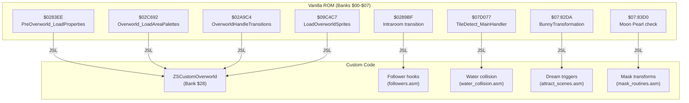
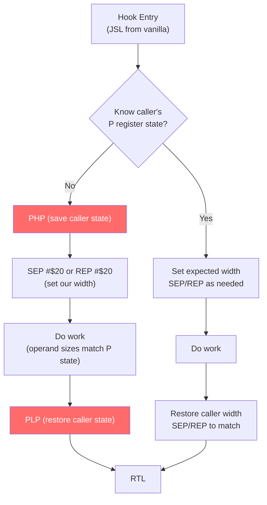
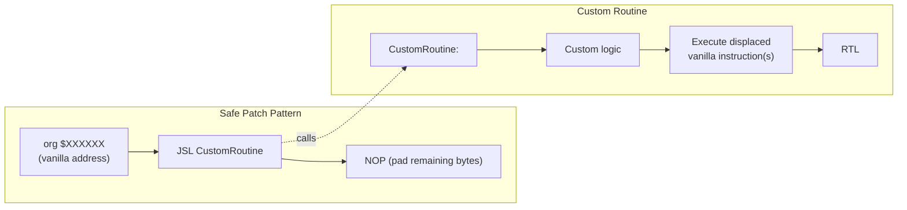

# Oracle of Secrets — ASM Hooks & Patches Subsystem

**Generated:** 2026-03-21
**Scope:** Hook architecture, ABI conventions, patch safety patterns, and known risk areas.

---

## Hook Architecture Overview



---

## 65816 ABI Standard



**Critical rules:**
1. M flag (bit 5) controls A size: 1=8-bit, 0=16-bit
2. X flag (bit 4) controls X/Y size: 1=8-bit, 0=16-bit
3. Mismatch causes BRK (crash) or silent register corruption
4. Long-entry routines (`*_Long`, `*_LongEntry`) are self-normalizing
5. Alternate hooks MUST preserve caller P state via PHP/PLP

---

## Hook Categories

### Overworld Hooks (ZSCustomOverworld)

| Address | Hook Name | Purpose | Feature Gate |
|---------|-----------|---------|-------------|
| $0283EE | PreOverworld_LoadProperties_Interupt | Load palettes/GFX per screen | Always ON |
| $02C692 | Overworld_LoadAreaPalettes | Palette swapping | Always ON |
| $02A9C4 | OverworldHandleTransitions | Screen-to-screen logic | Always ON |
| $09C4C7 | LoadOverworldSprites_Interupt | Sprite population (day/night) | Always ON |

### Follower Hooks

| Address | Hook Name | Purpose | Feature Gate |
|---------|-----------|---------|-------------|
| $0289BF | CheckForFollowerIntraroomTransition | Intraroom stairs/layers | `!ENABLE_FOLLOWER_TRANSITION_HOOKS` |
| (inter-room) | CheckForFollowerInterroomTransition | Door/room transitions | `!ENABLE_FOLLOWER_TRANSITION_HOOKS` |

### Dungeon Hooks

| Address | Hook Name | Purpose | Feature Gate |
|---------|-----------|---------|-------------|
| (water) | Custom water collision | Deep water tile checks | `!ENABLE_CUSTOM_ROOM_COLLISION` |
| (gates) | Water gate fill/drain | Zora Temple gates | `!ENABLE_WATER_GATE_HOOKS` |
| (gates) | Water gate overlay | Visual overlay redirect | `!ENABLE_WATER_GATE_OVERLAY_REDIRECT` |
| (gates) | Water gate room-entry | Persistence on re-entry | `!ENABLE_WATER_GATE_ROOMENTRY_RESTORE` |
| (prison) | D3 prison capture | Guard subtype gating | `!ENABLE_D3_PRISON_SEQUENCE` |

### Dream/Transform Hooks

| Address | Hook Name | Purpose | Feature Gate |
|---------|-----------|---------|-------------|
| $07:82DA | BunnyTransformation override | Dream sequence trigger | Always ON (prototype) |
| $07:83D0 | Moon Pearl check | Mask system integration | Always ON |

---

## Patch Safety Pattern



**Validation commands:**
```bash
Scripts/Build/build_rom.sh 168                    # Build
python3 Scripts/Build/check_zscream_overlap.py      # Check for address conflicts
python3 Scripts/Generate/generate_hooks_json.py        # Regenerate hook manifest
python3 Scripts/Validate/verify_hooks_json.py          # Verify hook integrity
```

---

## Known Risk Areas

### Register-Width Bugs (Fixed but verify)

The commit `d30fb96` (2026-02-07) applied register-width safety patches across 8 files touching hooks, sprites, and transitions. This is a broad change that could introduce subtle regressions if any operand size was misjudged.

**Files affected:** hooks, sprites, transitions (8 files total)

### Stack Corruption (Fixed)

Commit `ebb03d3` (2026-02-25) removed an orphaned PHX in the Overworld reload path. An unmatched push would corrupt the stack on every overworld reload, leading to eventual crashes.

**Risk:** If any other path depends on the extra stack byte, removing it could shift return addresses.

### Day/Night Sprite Conflict

The `LoadOverworldSprites_Interupt` hook at $09C4C7 conflicts with Oracle's night check system. The ZSOW sprite tables are static per-area, but Oracle's `Oracle_CheckIfNight` tries to swap sprite sets at runtime. Labels from Oracle namespace are not visible to ZSOW during build.

**Status:** Known limitation, not yet resolved.
