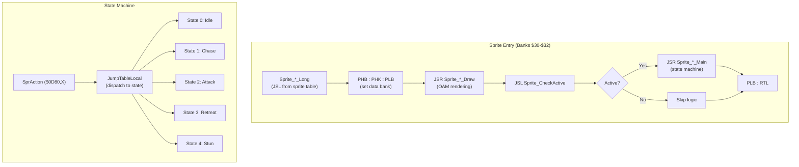
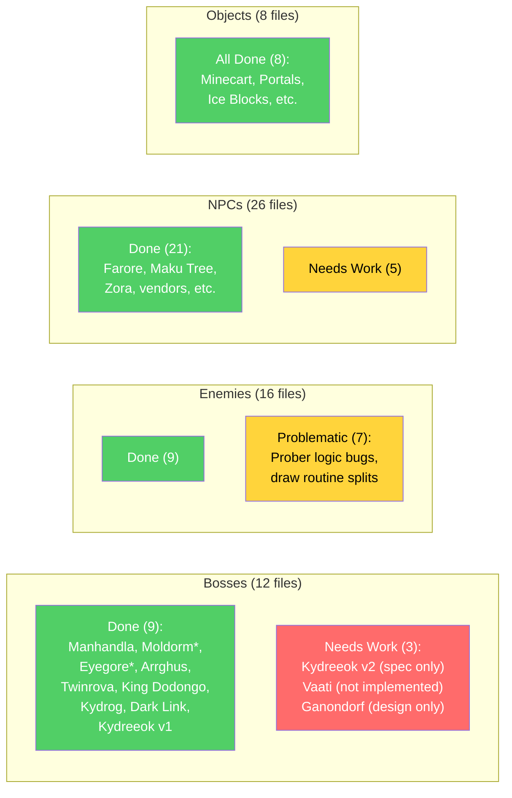

# Oracle of Secrets — Sprites Subsystem

**Generated:** 2026-03-21
**Scope:** Sprite architecture, state machines, catalog status, and known issues.

---

## Sprite System Architecture

---

## Sprite Memory Map

| Address | Name | Purpose |
|---------|------|---------|
| $0D00,X | SprY | Y position (16-bit with $0D20,X high) |
| $0D10,X | SprX | X position (16-bit with $0D30,X high) |
| $0D80,X | SprAction | Current state ID |
| $0DA0,X | SprHealth | Hit points remaining |
| $0DD0,X | SprState | Lifecycle (9=active, B=stunned) |
| $0E20,X | SprType | Sprite ID in registry |
| $0E40,X | SprNbrOAM | OAM slot count |
| $0EE0,X | SprTimerD | General-purpose timer |
| $0F50,X | SprSubtype | Variant selector (NPC dialogue, boss phase) |

---

## Sprite Catalog Status

---

## Boss Roster

| Dungeon | Boss | Type | File | Status |
|---------|------|------|------|--------|
| D1 Mushroom Grotto | Manhandla | Vanilla + hook | `manhandla.asm` | Works |
| D2 Tail Palace | Moldorm | Vanilla | None (spriteset swap) | Works |
| D3 Kalyxo Castle | Eyegore Knights | Vanilla reskin | None (Armos swap) | Works |
| D4 Zora Temple | Advanced Arrghus | Vanilla + hook | `arrghus.asm` | Works |
| D5 Glacia Estate | Twinrova | Vanilla override | `twinrova.asm` | Works |
| D6 Goron Mines | King Dodongo | Vanilla + tuning | `king_dodongo.asm` | Works |
| D7 Dragon Ship | Kydrog | Custom | `kydrog_boss.asm` | Combat works, rescue gated OFF |
| D8 Fortress | Dark Link | Custom | `dark_link.asm` | Works (mid-boss) |
| D8 Fortress | Kydreeok | Custom | `kydreeok.asm` | v1 works, v2 spec only |
| S3 Courage | Vaati | Custom | **Needs new file** | Not implemented |
| Final | Ganondorf | Custom (3-phase) | **Needs new file** | Design only |

**Design philosophy:** D1-D6 use vanilla bosses with spriteset swaps and minor hooks. Custom bosses (Kydreeok, Ganondorf, Vaati) reserved for climax where human review is guaranteed.

---

## Sprite Categories by Directory

```mermaid
graph TB
    ROOT["Sprites/"]
    ROOT --> BOSSES["Bosses/ (22 subdirs)"]
    ROOT --> ENEMIES["Enemies/ (18 subdirs)"]
    ROOT --> NPCS["NPCs/ (30 subdirs)"]
    ROOT --> OBJECTS["Objects/ (14 subdirs)"]
    ROOT --> REG["registry.csv<br/>sprite_registry_ids.asm"]
    ROOT --> ALL["all_sprites.asm<br/>(master include)"]
    ROOT --> OVR["overlord.asm"]

    BOSSES --> B1["manhandla.asm"]
    BOSSES --> B2["arrghus.asm"]
    BOSSES --> B3["twinrova.asm"]
    BOSSES --> B4["kydrog_boss.asm"]
    BOSSES --> B5["kydreeok.asm + kydreeok_head.asm"]
    BOSSES --> B6["dark_link.asm"]
    BOSSES --> B7["king_dodongo.asm"]

    NPCS --> N1["maku_tree.asm"]
    NPCS --> N2["farore.asm"]
    NPCS --> N3["zora.asm / zora_baby.asm"]
    NPCS --> N4["followers.asm"]
    NPCS --> N5["ranch_girl.asm"]
    NPCS --> N6["mask_salesman.asm"]
    NPCS --> N7["deku_scrub.asm"]
    NPCS --> N8["tingle.asm"]

    OBJECTS --> O1["minecart.asm"]
    OBJECTS --> O2["portal.asm"]
    OBJECTS --> O3["ice_block.asm"]
```

---

## Known Issues

### Prober System (Priority 1)

The vanilla Probe routine at `$05C15D` sets `$0D80,X` (SprAction), NOT `$0EE0,X` (SprTimerD) as some custom sprites assume. Current implementations have workarounds:
- **Booki:** Uses distance check (sees through walls — bug)
- **Darknut:** Alerts via damage only (ignores probe)

**Action needed:** Study vanilla Probe routine and correct custom enemy implementations.

### Kydreeok Boss AI

Version 1 works but lacks the designed multi-phase behavior. Version 2 spec exists but is not implemented. The three-head dragon form with independent neck tracking requires careful OAM and timer management.

### Lanmola + Minecart Lag

Both Lanmola boss and minecart movement are CPU-intensive. Running both in the same room may exceed frame budget. May need to choose one or optimize.

### Octoboss Camera

Hardcoded camera offset is likely wrong for custom room dimensions. Needs room-specific camera bounds check.

---

## Sprites Requiring Yaze/ZScream

The following sprite work requires coordination with Yaze (dungeon editor) or ZScream (overworld editor):

| Sprite | Tool | Reason |
|--------|------|--------|
| All dungeon boss sprites | Yaze | Room placement, spriteset assignment |
| Overworld NPCs | ZScream | Screen placement, sprite group tables |
| Minecart objects | Yaze | Track tile placement must match sprite data |
| Follower sprites | Both | Transition hooks depend on room data |
| Dungeon enemy placement | Yaze | Sprite slots, room capacity limits |
