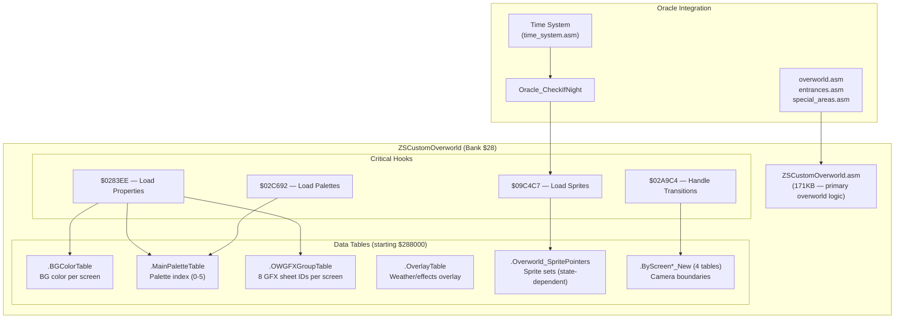
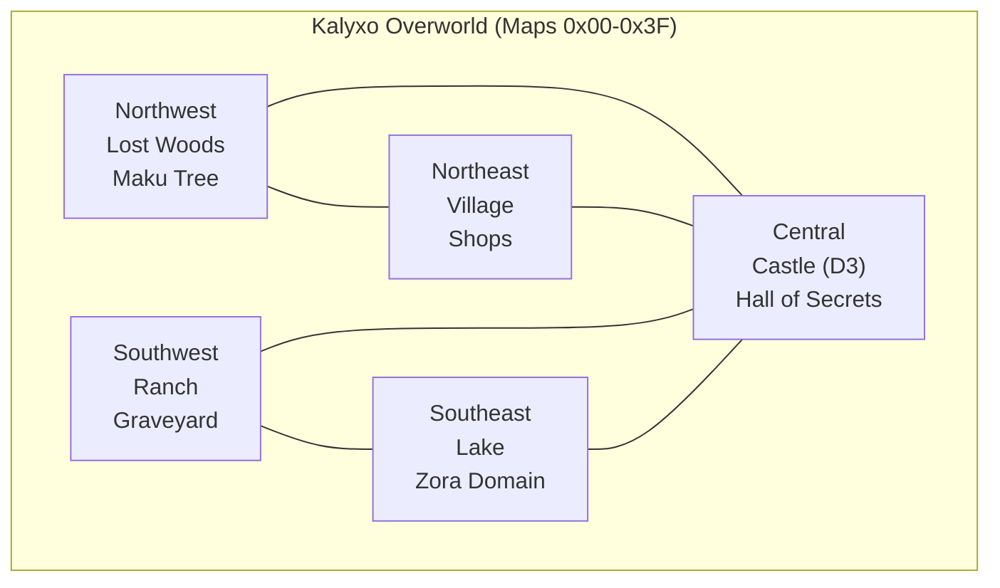
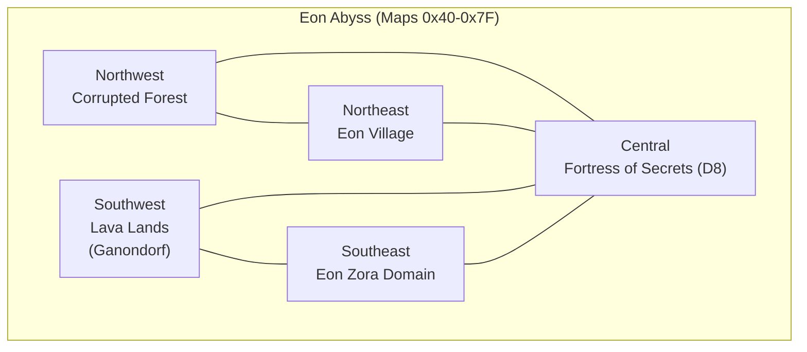
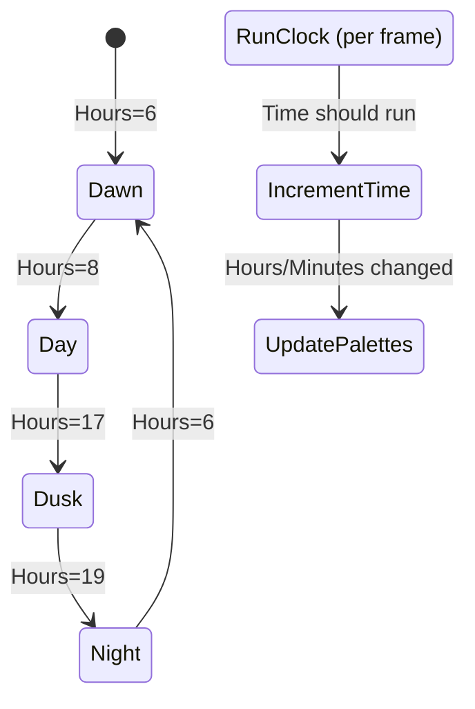
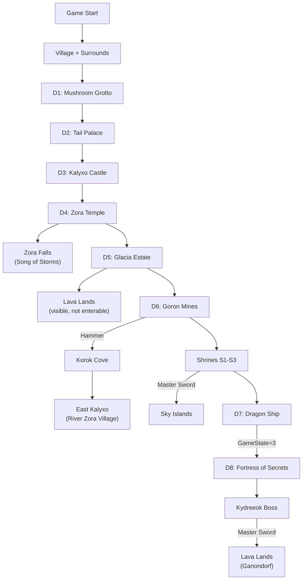

# Oracle of Secrets — Overworld Subsystem

**Generated:** 2026-03-21
**Scope:** ZSCustomOverworld data-driven engine, time system, world layout, and region definitions.

---

## Overworld Engine Architecture



---

## World Map Layout

### Light World (Kalyxo)



### Dark World (Eon Abyss)



### Special Overworld (Maps 0x80-0x9F)

```
     81  82  83  84  85  86  87
     ├───┼───┼───┼───┼───┼───┤
  80 │ K │ K │ E │ S │ S │ S │ S │
     ├───┼───┼───┼───┼───┼───┼───┤
  88 │ K │ K │ E │ S │ S │ S │ S │
     ├───┼───┼───┼───┼───┼───┼───┤
  90 │ E │ E │ E │ E │   │   │   │
     ├───┼───┼───┼───┼───┼───┼───┤
  98 │ E │ E │ E │ E │   │   │   │
     └───┴───┴───┴───┴───┴───┴───┘

K = Korok Cove (81, 82, 89, 8A)
E = East Kalyxo (83, 8B, 90-93, 98-9B)
S = Sky Islands (84-87, 8C-8F)
```

---

## Time System



**Structure at $7EE000:**
```
TimeState.Hours    — Current hour (0-23)
TimeState.Minutes  — Current minute (0-59)
TimeState.Speed    — Clock rate multiplier
TimeState.BlueVal  — Blue palette subtraction
TimeState.GreenVal — Green palette subtraction
TimeState.RedVal   — Red palette subtraction
```

**Integration:**
- `Oracle_CheckIfNight` — Called by ZSOW for sprite loading decisions
- Palette tinting — Subtracts RGB values from overworld palettes based on hour
- NPC behavior — Some NPCs check time for dialogue/presence changes

---

## Overworld Files

| File | Size | Purpose |
|------|------|---------|
| `ZSCustomOverworld.asm` | 171KB | Primary data-driven overworld engine |
| `overworld.asm` | — | Oracle overworld extensions |
| `entrances.asm` | — | Dungeon/building entrance definitions |
| `lost_woods.asm` | — | Lost Woods transition logic |
| `overlays.asm` | — | Weather/effect overlays |
| `special_areas.asm` | — | Unique area logic |
| `time_system.asm` | — | Day/night cycle |
| `weathervane.asm` | — | Weathervane teleport points |
| `world_map.asm` | — | World map screen data |
| `custom_gfx.asm` | — | Custom graphics loading |
| `HardwareRegisters.asm` | — | SNES register definitions |

---

## Region Access Progression



---

## Known Issues

### Day/Night Sprite Conflict
ZSOW's `.Overworld_SpritePointers_state_..._New` tables are static per-area, compiled at build time. Oracle's `Oracle_CheckIfNight` runs at runtime to swap sprite sets for day/night. Labels from Oracle namespace are not visible to ZSOW during assembly, creating a disconnect.

### Lost Woods Logic
Custom transition logic in `lost_woods.asm` controls the Lost Woods maze sequence. If the player enters from an unexpected direction or with certain masks active, the transition state may not reset properly.

### Overworld → Dungeon Transition Black Screen
Fixed in commit `ebb03d3` (orphaned PHX removed from overworld reload), but the broader transition path should be regression-tested after any hook changes.
