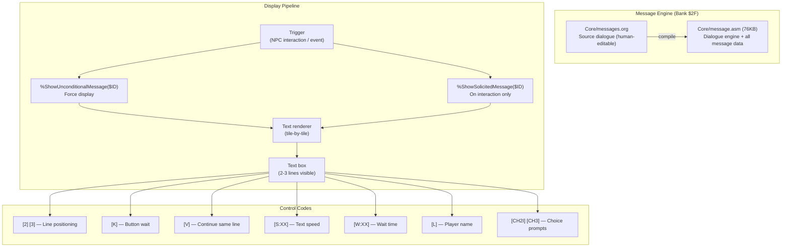
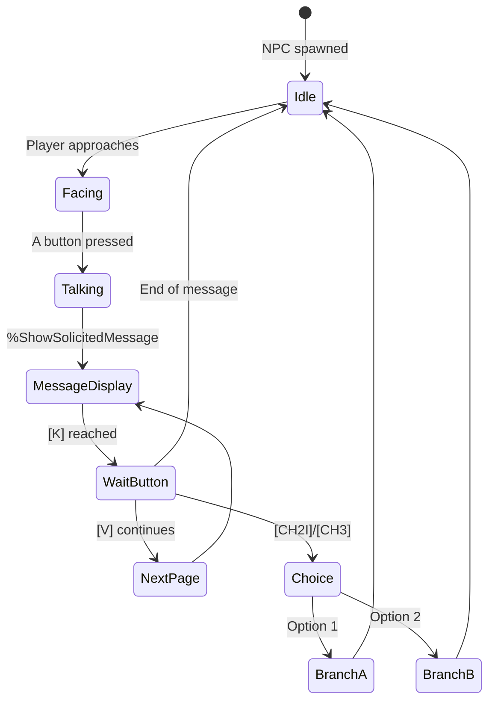
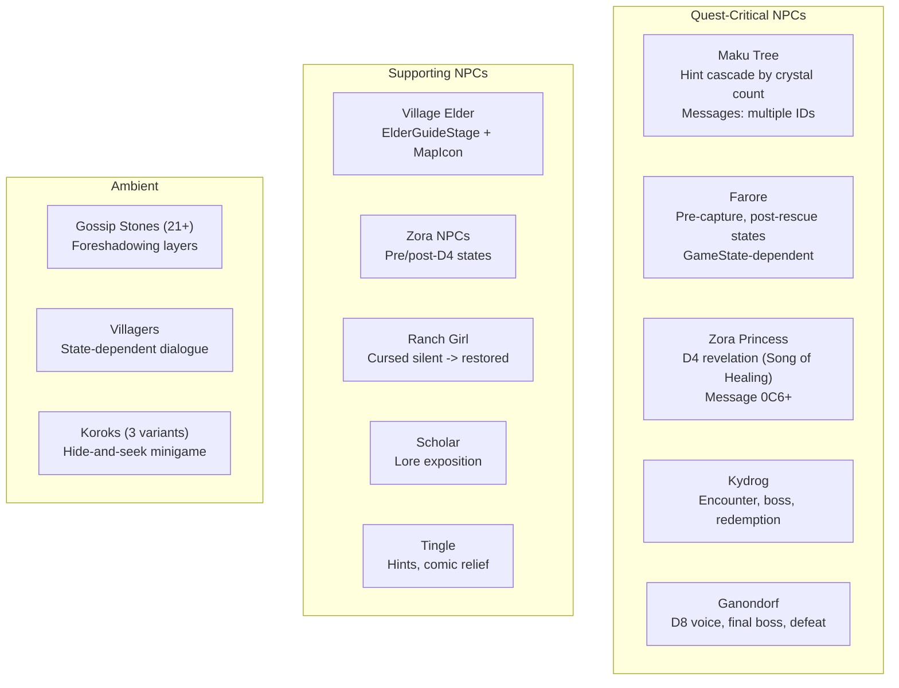

# Oracle of Secrets — Dialogue & Messages Subsystem

**Generated:** 2026-03-21
**Scope:** Message format, dialogue engine, control codes, NPC dialogue states, and content status.

---

## Message System Architecture



---

## Message Format

Messages are defined in `messages.org` with this format:

```
** <ID> - <Description>
[W:02][S:03]<Text content>
[2]<Line 2 text>
[3]<Line 3 text>
[V]<Continuation text>
[K]<Wait for button>
```

### Control Code Reference

| Code | Meaning | Example |
|------|---------|---------|
| `[2]` | Position to line 2 | `[2]Second line here` |
| `[3]` | Position to line 3 | `[3]Third line here` |
| `[K]` | Wait for button press | End of text block |
| `[V]` | Continue (same box, next page) | Multi-page dialogue |
| `[W:XX]` | Wait XX frames | `[W:02]` = brief pause |
| `[S:XX]` | Set text speed | `[S:03]` = normal speed |
| `[L]` | Insert player name | `Hello, [L]!` |
| `[CH2I]` | 2-choice prompt | Yes/No questions |
| `[CH3]` | 3-choice prompt | Multiple options |

---

## Dialogue State Machine (NPC)



---

## Key NPC Dialogue Groups



---

## Foreshadowing Layers

| Layer | Source | Content | Status |
|-------|--------|---------|--------|
| 1 | Gossip Stones | "A king who ruled from darkness...", seal hints | Slots $1D2-$1D4 exist (placeholder bytes). 21 stones written, need message IDs |
| 2 | Scholar/Library | Sealing ritual, priestess sacrifice, portal magic | `scholar_dialogue_rewrite.md` exists |
| 3 | D8 Voice | 4 escalating encounters (philosophy → revelation) | Design only, not implemented |
| 4 | Temporal Pyramid | 3 walk-through visions | Design only |
| 5 | Name Drop | "I am Ganondorf." (Lava Lands) | Design only |

---

## Dialogue Content Status

| Category | Written | In messages.org | In ROM | Tested |
|----------|---------|----------------|--------|--------|
| Core NPC dialogue | Yes | Partial | Partial | Partial |
| Maku Tree hint cascade | Yes | Yes | Yes | Needs verify |
| Zora Princess revelation | Yes | Yes | Partial | No |
| Twinrova boss dialogue | Yes (draft) | No | No | No |
| Kydrog redemption | Yes (draft) | No | No | No |
| Ganondorf dialogue | Yes (draft) | No | No | No |
| D8 Voice encounters | Yes (draft) | No | No | No |
| Gossip Stones (21) | Yes | No | Placeholder | No |
| Ranch Girl restoration | Yes (draft) | No | No | No |
| East Kalyxo reconciliation | Yes (draft) | No | No | No |
| Post-game healing dialogue | Yes (draft) | No | No | No |

---

## Message System Expansion

Bank $2F ($2F8000-$2FFFFF) is the expanded message bank with 32KB capacity. Current usage is significant (76KB message.asm including engine code), but there is room for the planned dialogue additions.

**Key concern:** Message IDs must be unique and sequential. Adding new messages in the middle of the ID space requires updating all subsequent references. The `normalize_dialogue_bundles.py` script helps manage this.
