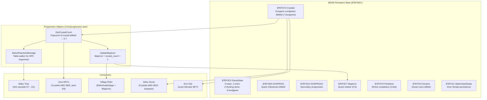
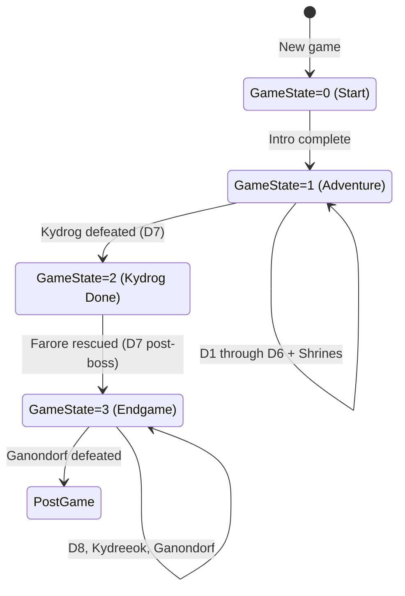
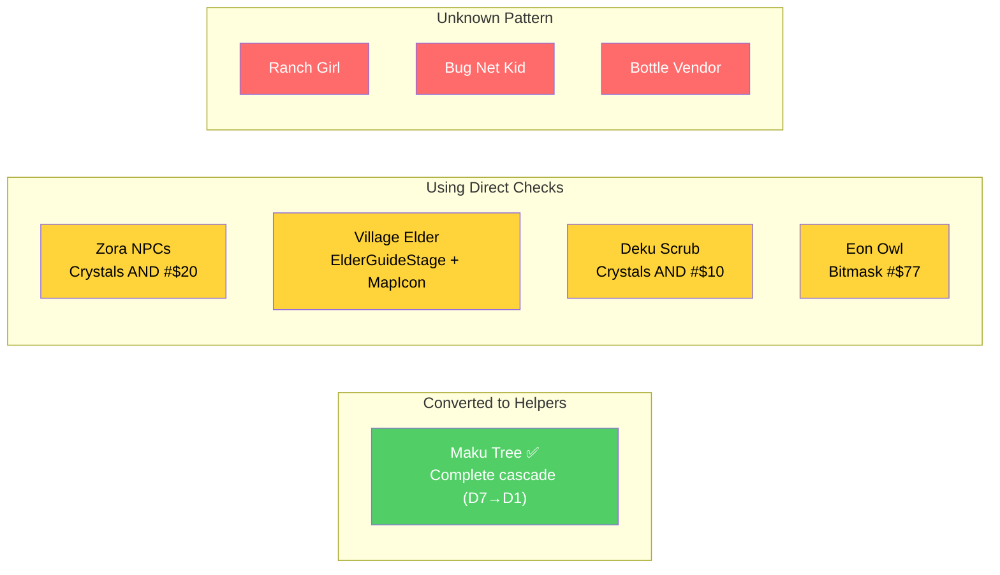
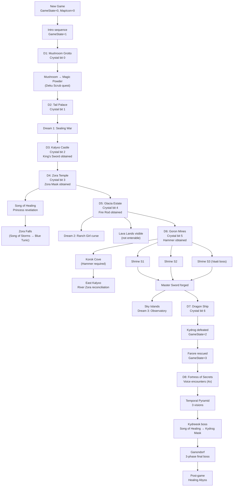

# Oracle of Secrets — Progression & Flags Subsystem

**Generated:** 2026-03-21
**Scope:** Quest state management, SRAM layout, progression helpers, MapIcon system, and NPC conversion status.

---

## Progression Architecture



---

## GameState Progression



---

## MapIcon Values

| Value | Location | Trigger |
|-------|----------|---------|
| $00 | Maku Tree (start) | Game start |
| $01 | D1 Mushroom Grotto | After intro |
| $02 | D2 Tail Palace | D1 crystal |
| $03 | D3 Kalyxo Castle | D2 crystal |
| $04 | D4 Zora Temple | D3 crystal |
| $05 | D5 Glacia Estate | D4 crystal |
| $06 | D6 Goron Mines | D5 crystal |
| $07 | D7 Dragon Ship | D6 crystal |
| $08 | Fortress of Secrets | D7 crystal |
| $09 | Tail Pond | Special |

---

## Crystal Bitfield ($7EF37A)

```
Bit 0 = D1 (Mushroom Grotto)
Bit 1 = D2 (Tail Palace)
Bit 2 = D3 (Kalyxo Castle)
Bit 3 = D4 (Zora Temple)
Bit 4 = D5 (Glacia Estate)
Bit 5 = D6 (Goron Mines)
Bit 6 = D7 (Dragon Ship)
```

---

## NPC Conversion Status

The progression infrastructure provides shared helpers (`GetCrystalCount`, `UpdateMapIcon`, `SelectReactionMessage`) to replace per-NPC hardcoded checks. Current conversion status:



---

## Progression Gating (Full Chain)



---

## Feature-Gated Progression Code

| Feature | Gate | Status | Risk |
|---------|------|--------|------|
| D3 Prison capture/escape | `!ENABLE_D3_PRISON_SEQUENCE` = 0 | OFF, untested | Progression desync |
| D7 Farore rescue pipeline | `!ENABLE_D7_FARORE_RESCUE_SEQUENCE` = 0 | OFF, untested | GameState transition |
| Minecart cart-required shutters | `!ENABLE_MINECART_CART_SHUTTERS` = 0 | OFF, untested | Dungeon soft-lock |
| Water gate room-entry restore | `!ENABLE_WATER_GATE_ROOMENTRY_RESTORE` = 0 | OFF, untested | Save corruption |
