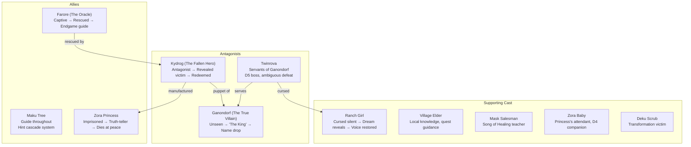
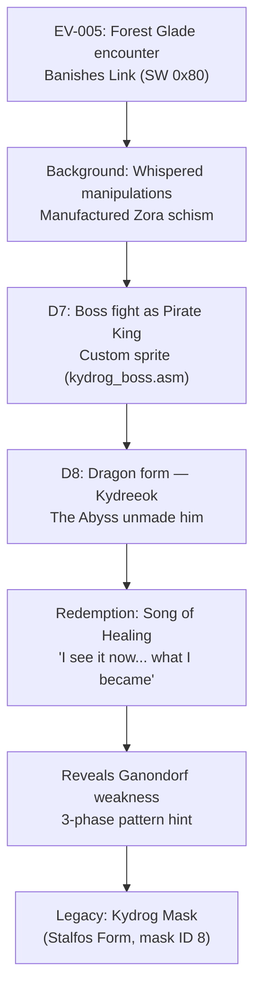
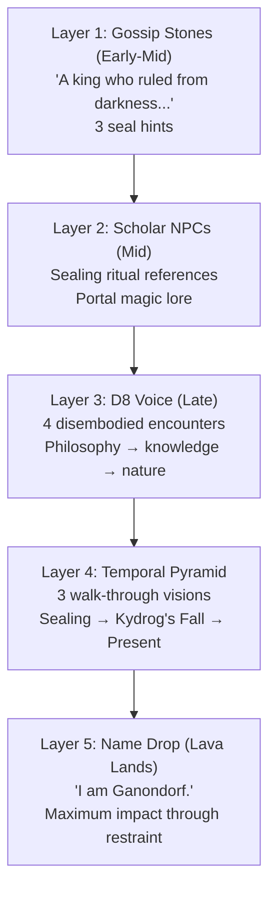
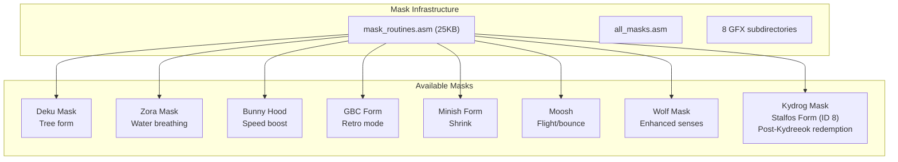

# Oracle of Secrets — Plot & Characters

**Generated:** 2026-03-21
**Scope:** Three-act narrative structure, character arcs, dream sequences, and boss encounters.

---

## Three-Act Structure

```mermaid
graph LR
    subgraph "Act I: The Island's Wounds (D1-D3)"
        A1_D1["D1 Mushroom Grotto<br/>Boss: Manhandla<br/>Nature corruption"]
        A1_D2["D2 Tail Palace<br/>Boss: Moldorm<br/>Deku quest, Song of Healing"]
        A1_DREAM["Dream 1<br/>The Sealing War<br/>Kydrog's origin"]
        A1_D3["D3 Kalyxo Castle<br/>Boss: Eyegore Knights<br/>Prison escape, King's Sword"]

        A1_D1 --> A1_D2 --> A1_DREAM --> A1_D3
    end

    subgraph "Act II: The Conspiracy Unravels (D4-D6)"
        A2_D4["D4 Zora Temple<br/>Boss: Arrghus<br/>Princess reveals conspiracy"]
        A2_D5["D5 Glacia Estate<br/>Boss: Twinrova<br/>Portal to Lava Lands"]
        A2_DREAM["Dream 2<br/>Ranch Girl cursed<br/>by Twinrova"]
        A2_D6["D6 Goron Mines<br/>Boss: King Dodongo<br/>Hammer, Goron trust"]
        A2_SHRINES["Shrines S1-S3<br/>S3 Boss: Vaati<br/>Master Sword forged"]
        A2_SKY["Sky Islands<br/>Dream 3: Observatory<br/>Ganondorf revealed"]

        A2_D4 --> A2_D5 --> A2_DREAM --> A2_D6 --> A2_SHRINES --> A2_SKY
    end

    subgraph "Act III: Confrontation (D7-Final)"
        A3_D7["D7 Dragon Ship<br/>Boss: Kydrog<br/>Farore rescued"]
        A3_D8["D8 Fortress<br/>Mid-boss: Dark Link<br/>4 Voice encounters"]
        A3_PYRAMID["Temporal Pyramid<br/>3 time visions"]
        A3_KYDREEOK["Kydreeok<br/>Dragon form boss<br/>Kydrog redeemed"]
        A3_GANON["Ganondorf<br/>3-phase final boss<br/>'I am Ganondorf.'"]

        A3_D7 --> A3_D8 --> A3_PYRAMID --> A3_KYDREEOK --> A3_GANON
    end
```

---

## Character Arc Map

---

## Kydrog's Arc (Detailed)

---

## Ganondorf Revelation Layers

---

## Dream Sequences

| # | Name | Trigger | Content | Priority | Status |
|---|------|---------|---------|----------|--------|
| 1 | The Sealing War | After D2 | Kydrog's origin, ancient soldier sprite | Critical | Script written, not implemented |
| 2 | Ranch Girl | After D5 | Twinrova cursing witness, surreal ranch | Critical | Script written, not implemented |
| 3 | Observatory Vision | Sky Islands | Ganondorf imprisonment, sealing ritual | Critical | Script written, not implemented |
| 4 | The Reflection | After D3 | Mirror shows Kydrog-as-knight | Polish | Script written, not implemented |
| 5 | The Giant's Message | After D6 | "It is happening again" | Polish | Script written, not implemented |

**Infrastructure exists:** `attract_scenes.asm` base system, `$7EF410` dreams bitfield, prototype hooks. No dream content in code.

---

## Parallel Story Arcs

```mermaid
graph TB
    subgraph "Zora Arc"
        Z1["D4: Princess reveals conspiracy"]
        Z2["Post-D4: Sea Zora dialogue updates"]
        Z3["Post-D6: East Kalyxo access (Hammer)"]
        Z4["East Kalyxo: Reconciliation scene"]
        Z1 --> Z2 --> Z3 --> Z4
    end

    subgraph "Goron Arc"
        G1["D6: Goron Mines (trade routes disrupted)"]
        G2["Rock Meat quest reopens mines"]
        G3["Goron trust restored"]
        G1 --> G2 --> G3
    end

    subgraph "Ranch Girl Arc"
        R1["Pre-D5: Silent, cursed"]
        R2["D5: Defeat Twinrova"]
        R3["Dream 2: Witness the curse"]
        R4["Post-D5: Song of Healing → voice restored"]
        R1 --> R2 --> R3 --> R4
    end
```

---

## Dungeon Themes & Items

| Dungeon | Name | Theme | Boss | Key Item | Mask |
|---------|------|-------|------|----------|------|
| D1 | Mushroom Grotto | Nature corruption | Manhandla | — | — |
| D2 | Tail Palace | Ancient temple | Moldorm | — | — |
| D3 | Kalyxo Castle | Occupied fortress | Eyegore Knights | King's Sword | — |
| D4 | Zora Temple | Underwater ruins | Arrghus | Zora Mask | Zora |
| D5 | Glacia Estate | Frozen manor | Twinrova | Fire Rod | — |
| D6 | Goron Mines | Industrial mines | King Dodongo | Hammer | — |
| S1-S3 | Shrines | Trials | S3: Vaati | Master Sword | — |
| D7 | Dragon Ship | Pirate vessel | Kydrog | — | — |
| D8 | Fortress of Secrets | Dark fortress | Kydreeok | — | Kydrog Mask |
| Final | Lava Lands | Prison realm | Ganondorf | — | — |

---

## Mask System

---

## Sprites Needed (Not Yet Created)

| Sprite | For | Priority | Notes |
|--------|-----|----------|-------|
| Ancient Soldier | Dream 1 | Critical | Hylian Knight with distinct helmet, silver/blue palette |
| Cumuli | Sky Islands | Medium | Fluffy cloud creatures, shy, simple design |
| River Zora variants | East Kalyxo | Medium | May need distinct from Sea Zora |
| Ganondorf | Final boss | Critical | Humanoid wizard-king, Gerudo features, 3-phase |
| Vaati | Shrine S3 | High | Custom boss, no file exists |
