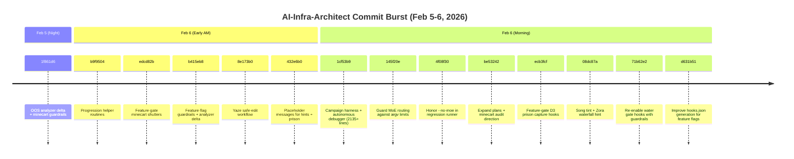
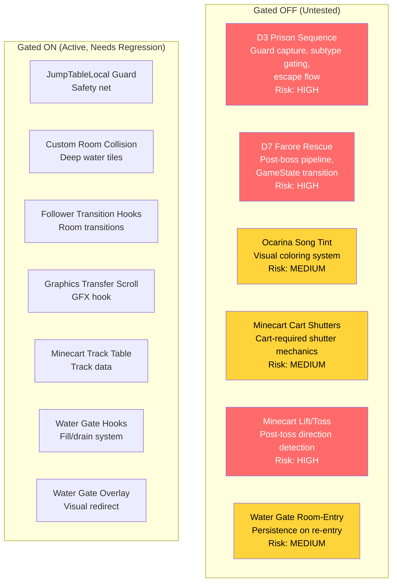
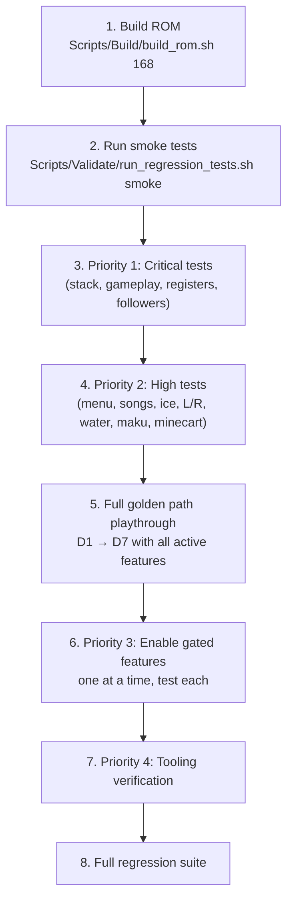

# Oracle of Secrets — AI-Generated Feature Lineage & Regression Task List

**Generated:** 2026-03-21
**Scope:** Oct 2025 - March 2026. Identifies all AI-generated commits, untested features, and organizes testing tasks by priority.

---

## AI Commit Lineage

### Summary

| Category | Count | Period |
|----------|-------|--------|
| `ai-infra-architect` prefixed commits | 14 | Feb 5-6, 2026 |
| `Generated with Claude Code` watermark | 6 | Nov-Dec 2025 |
| Explicitly marked UNTESTED | 1 | Jan 2026 |
| **Total AI-touched commits** | **21** | Oct 2025 - Mar 2026 |
| Total commits in period | 311 | — |
| AI percentage | 6.8% | — |

---

### AI-Infra-Architect Commits (Feb 5-6, 2026)

These 14 commits were generated in a single burst and touch infrastructure, feature gates, hooks, and game logic.

#### Risk Assessment per Commit

| Hash | Subject | Files | Risk | Tested |
|------|---------|-------|------|--------|
| **1f861d6** | OOS analyzer delta + minecart guardrails | Scripts, config | LOW | N/A (tooling) |
| **b9f9504** | Add progression helper routines | `Core/progression.asm` | **HIGH** | No |
| **edcd82b** | Feature-gate minecart cart-required shutters | Dungeons, config | MEDIUM | No (gated OFF) |
| **b415eb8** | Feature-flag guardrails + analyzer delta wiring | Config, scripts | LOW | N/A (tooling) |
| **8e173b0** | Yaze safe-edit workflow | Scripts | LOW | N/A (tooling) |
| **432e6b0** | Reserve placeholder messages for hints + prison | `Core/message.asm` | MEDIUM | No |
| **1cf53b9** | Campaign harness + autonomous debugger | Scripts (2135+ lines) | MEDIUM | No (tooling) |
| **145f20e** | Guard MoE routing against argv limits | Scripts | LOW | N/A |
| **4f08f30** | Honor --no-moe in regression runner | Scripts | LOW | N/A |
| **be53242** | Expand plans + minecart audit direction | Docs | LOW | N/A |
| **ecb3fcf** | Feature-gate D3 prison capture hooks | `Dungeons/custom_tag.asm` | **HIGH** | No (gated OFF) |
| **08dc87a** | Song tint + Zora waterfall hint | `Items/ocarina.asm`, sprites | MEDIUM | No (gated OFF) |
| **71b62e2** | Re-enable water gate hooks with guardrails | `Dungeons/Collision/` | **HIGH** | No |
| **d631b51** | Improve hooks.json generation for feature flags | Scripts | LOW | N/A |

---

### Claude Code Watermarked Commits (Nov-Dec 2025)

| Hash | Date | Subject | Files | Risk | Tested |
|------|------|---------|-------|------|--------|
| **8b23049** | 2025-11-22 | Fix menu system crashes and stability issues | Menu system | **HIGH** | Partial |
| **841ef2d** | 2025-12-06 | Fix Song of Storms: Rain persists | Overworld, items | MEDIUM | No |
| **791ebaf** | 2025-12-06 | Fix menu navigation: restore original up/down | Menu | MEDIUM | No |
| **d01a4b8** | 2025-12-06 | Fix ActivateSubScreen: prevent fallthrough | Menu | MEDIUM | No |
| **1c19788** | 2025-12-07 | Fix HUD artifact: Revert FloorIndicator overflow | Menu/HUD | MEDIUM | No |
| **57012b2** | 2025-12-09 | Ice block push direction validation | Dungeons | MEDIUM | No |

---

### Explicitly UNTESTED Commit

| Hash | Date | Subject | Risk |
|------|------|---------|------|
| **32129a8** | 2026-01-21 | Add L/R button swap for Hookshot/Goldstar (UNTESTED) | **HIGH** — Input handling regression |

---

### Other High-Risk Non-AI Commits

| Hash | Date | Subject | Risk | Tested |
|------|------|---------|------|--------|
| **4394bad** | 2026-02-25 | feat(gameplay): update dungeon collision, message system, runtime scripts (14 files) | **CRITICAL** | No |
| **0342300** | 2026-02-25 | feat(d6): fix minecart room invariants | MEDIUM | No |
| **ebb03d3** | 2026-02-25 | fix: remove orphaned PHX (stack corruption) | **HIGH** | No |
| **fdf4836** | 2026-02-06 | feat: Maku Tree hint cascade, D3 prison guard, minecart lift/toss | **HIGH** | No |
| **d30fb96** | 2026-02-07 | fix: register-width safety for hooks, sprites, transitions (8 files) | **HIGH** | No |

---

## Feature-Gated Code (All Disabled, All Untested)

---

## Regression Test Task List

### Priority 1: CRITICAL (Blocking — Test Before Any New Work)

| # | Task | Commit(s) | How to Test | Pass Criteria |
|---|------|-----------|-------------|---------------|
| 1.1 | **Stack integrity after overworld reload** | ebb03d3 | Load save → transition OW → OW 20+ times, monitor SP | No crash, SP returns to baseline after each transition |
| 1.2 | **14-file gameplay update** | 4394bad | Full golden path playthrough D1→D7 | No new softlocks, dialogue displays correctly, dungeon collision works |
| 1.3 | **Register-width safety** | d30fb96 | Exercise all 8 modified hooks in gameplay | No BRK exceptions, no visual glitches |
| 1.4 | **Follower transitions** | Follower hooks (ON) | Enter/exit buildings, stairs, dungeon doors with follower | No black screen, follower persists |

### Priority 2: HIGH (Test Before Beta)

| # | Task | Commit(s) | How to Test | Pass Criteria |
|---|------|-----------|-------------|---------------|
| 2.1 | **Menu system stability** | 8b23049, 791ebaf, d01a4b8, 1c19788 | Navigate all menu pages, open/close rapidly, switch items | No crashes, correct cursor behavior, no HUD artifacts |
| 2.2 | **Song of Storms persistence** | 841ef2d | Play Song of Storms → transition between screens → enter buildings | Rain persists only where intended, no visual leak |
| 2.3 | **Ice block physics** | 57012b2 | Push ice blocks in all 4 directions, push against walls, push off ledges | Correct directional validation, no phantom movement |
| 2.4 | **L/R button swap** | 32129a8 | Equip Hookshot, press L/R, equip Goldstar, press L/R | Correct item swap, no input state corruption |
| 2.5 | **Water gate system** | 71b62e2, Water hooks (ON) | Fill/drain gates in Zora Temple, exit room, re-enter, save/reload | Gate state persists correctly |
| 2.6 | **Maku Tree hint cascade** | fdf4836, b9f9504 | Talk to Maku Tree at 0, 1, 3, 5, 7 crystals | Correct hint per crystal count, no message ID errors |
| 2.7 | **Minecart room invariants** | 0342300 | Ride minecart through D6 rooms 0xA8, 0xB8, 0xD8, 0xDA | Cart stops on stop tiles, no derailing |
| 2.8 | **Progression helpers** | b9f9504 | Verify GetCrystalCount, UpdateMapIcon at each dungeon completion | Correct count, MapIcon updates |

### Priority 3: MEDIUM (Test Before Feature-Gate Enable)

| # | Task | Commit(s) | How to Test | Pass Criteria |
|---|------|-----------|-------------|---------------|
| 3.1 | **D3 Prison sequence** | ecb3fcf | Enable flag, enter D3, trigger guard capture, complete escape | No softlock, flags set correctly |
| 3.2 | **D7 Farore rescue** | 4394bad | Enable flag, defeat Kydrog, complete rescue pipeline | GameState transitions 2→3, Farore appears in Hall |
| 3.3 | **Ocarina song tint** | 08dc87a | Enable flag, play all ocarina songs | Visual tinting works, no palette corruption |
| 3.4 | **Minecart cart shutters** | edcd82b | Enable flag, approach shutter without/with cart | Shutter blocks without cart, opens with cart |
| 3.5 | **Minecart lift/toss** | fdf4836 | Enable flag, ride to lift, toss off track | Physics work, direction detection correct |
| 3.6 | **Water gate room-entry restore** | 71b62e2 | Enable flag, fill gate, exit room, re-enter | Gate state restored on room entry |

### Priority 4: LOW (Tooling Verification)

| # | Task | Commit(s) | How to Test | Pass Criteria |
|---|------|-----------|-------------|---------------|
| 4.1 | **Campaign harness** | 1cf53b9 | Run autonomous debugger in monitor mode | No errors, detects anomalies |
| 4.2 | **Hooks.json generation** | d631b51 | Rebuild with feature flags on/off, compare hooks.json | Correct hooks reflected per flag state |
| 4.3 | **Regression test runner** | 4f08f30, 145f20e | Run `bash Scripts/Validate/run_regression_tests.sh smoke --no-moe --fail-fast` | Suite passes |

---

## Testing Infrastructure

### Available Test Tools

| Tool | Command | Purpose |
|------|---------|---------|
| Build | `Scripts/Build/build_rom.sh 168` | Assemble ROM |
| Overlap check | `python3 Scripts/Build/check_zscream_overlap.py` | Detect address conflicts |
| Smoke tests | `bash Scripts/Validate/run_regression_tests.sh smoke --no-moe --fail-fast` | Quick regression |
| Full regression | `bash Scripts/Validate/run_regression_tests.sh` | Complete test suite |
| Autonomous debugger | `python3 -m scripts.campaign.autonomous_debugger --monitor --fail-on-anomaly` | Runtime monitoring |
| Mesen2 debug | `Scripts/Mesen2/mesen2_client.py` | Emulator automation |
| State capture | `python3 Scripts/Debug/capture_state.py` | Save state snapshots |
| Feature flags | `python3 Scripts/Build/set_feature_flags.py` | Toggle features |
| Module isolation | `bash Scripts/Validate/run_module_isolation.sh` | Disable modules for bisect |

### Test Data

| Location | Content |
|----------|---------|
| `tests/smoke/` | Boot, basic transition, lint pass |
| `tests/regression/` | Golden path, overworld, dungeon, stack corruption, Y overflow |
| `Roms/SaveStates/` | Saved game states for specific test scenarios |
| `Roms/SaveData/` | SRAM dumps |

---

## Recommended Testing Order

---

## Files Containing Untested AI-Generated Code

For reference, these are the exact files that contain AI-generated code needing verification:

| File | AI Source | What to Check |
|------|-----------|---------------|
| `Core/progression.asm` | ai-infra-architect (b9f9504) | Helper routines: GetCrystalCount, UpdateMapIcon, SelectReactionMessage |
| `Core/message.asm` | ai-infra-architect (432e6b0) | Placeholder message IDs for hints + prison |
| `Config/feature_flags.asm` | ai-infra-architect (b415eb8) | All flag definitions and defaults |
| `Dungeons/custom_tag.asm` | ai-infra-architect (ecb3fcf) | D3 prison capture hooks |
| `Dungeons/Collision/water_collision.asm` | ai-infra-architect (71b62e2) | Re-enabled water gate hooks |
| `Items/ocarina.asm` | ai-infra-architect (08dc87a) | Song tint feature |
| `Items/hookshot.asm` or `goldstar.asm` | scawful (32129a8) | L/R button swap (UNTESTED) |
| `Sprites/Objects/minecart.asm` | ai-infra-architect (edcd82b, fdf4836) | Lift/toss, cart shutters |
| `Sprites/Bosses/kydrog_boss.asm` | 4394bad | D7 Farore rescue scaffolding |
| `Menu/menu.asm` | Claude Code (8b23049, 791ebaf, d01a4b8) | Stability fixes, navigation |
| `Menu/menu_hud.asm` | Claude Code (1c19788) | FloorIndicator overflow fix |
| `Overworld/time_system.asm` | Claude Code (841ef2d) | Song of Storms rain persistence |
| `scripts/campaign/` | ai-infra-architect (1cf53b9) | Autonomous debugger (2135+ lines) |
