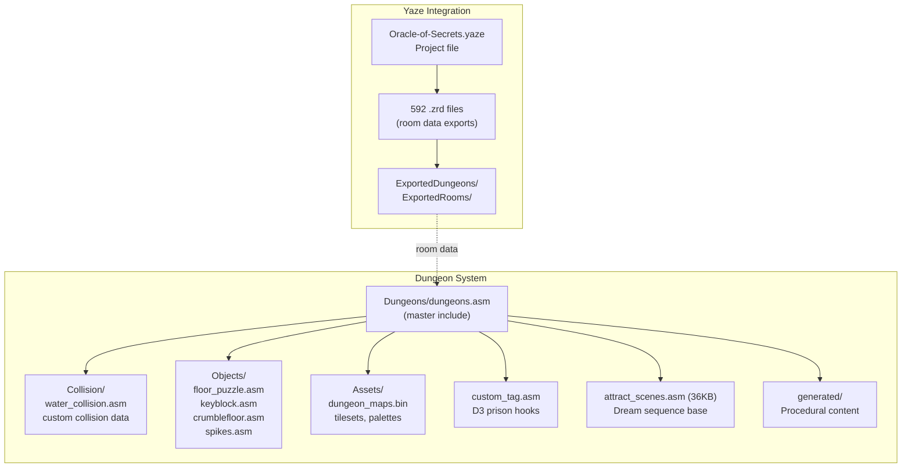
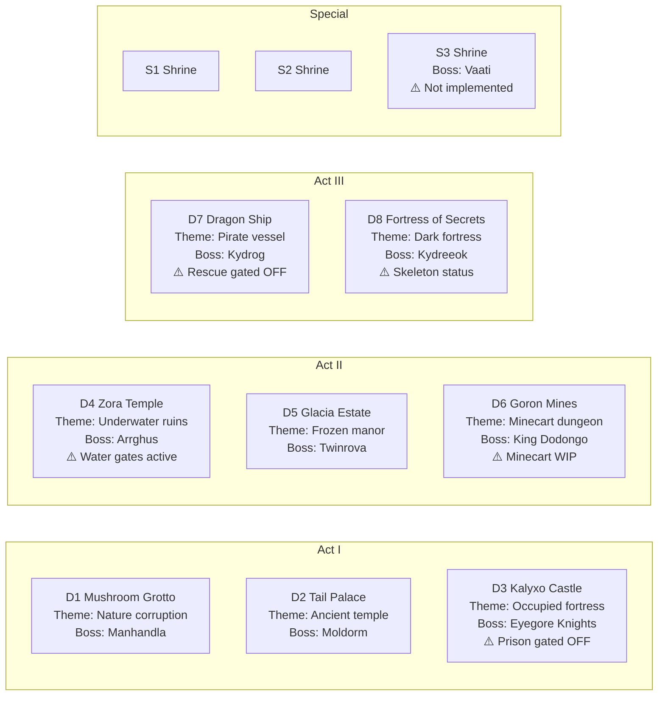
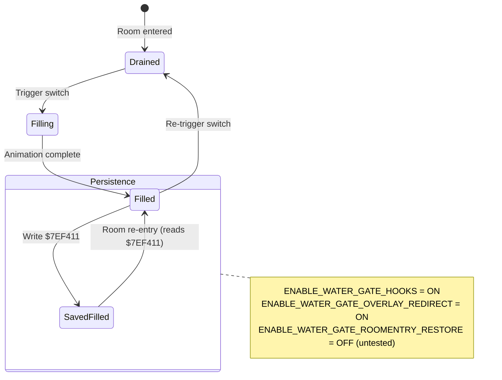
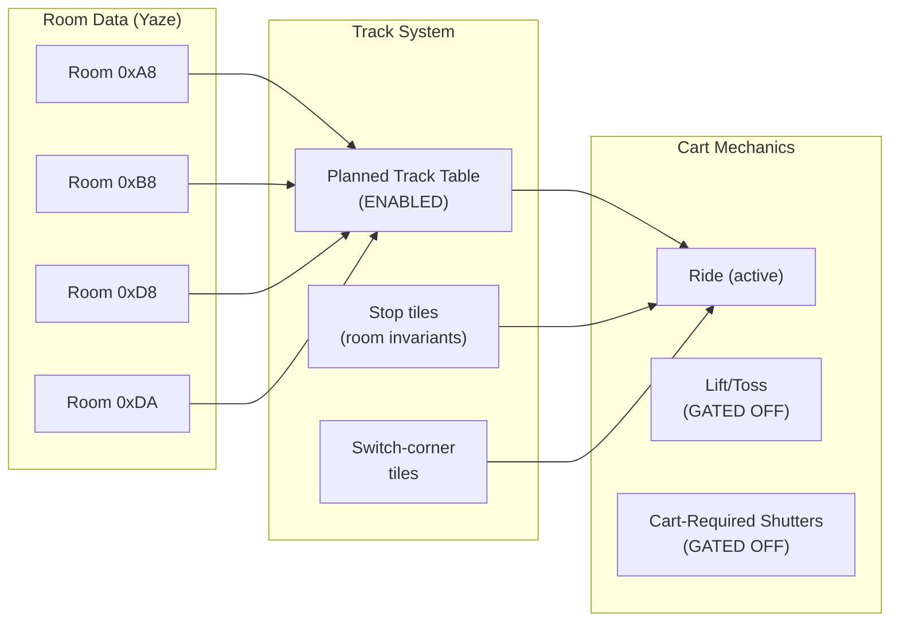
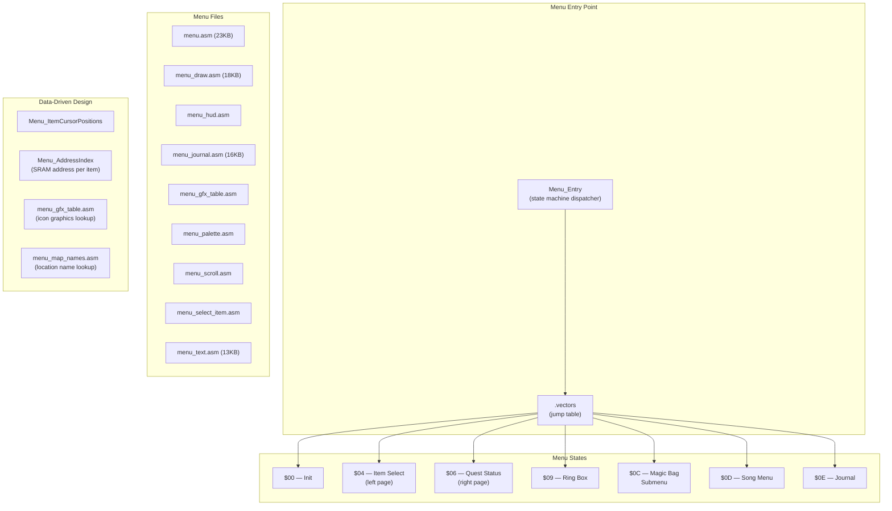
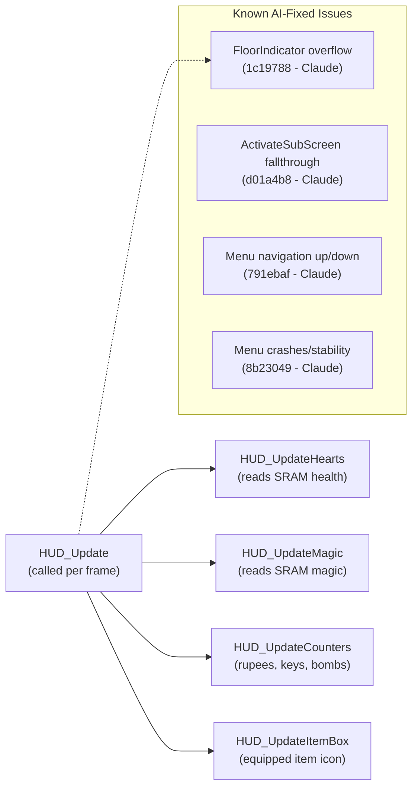
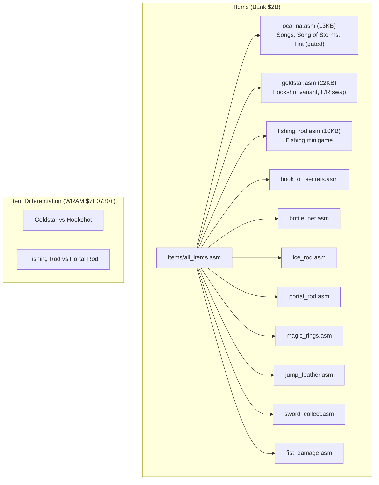
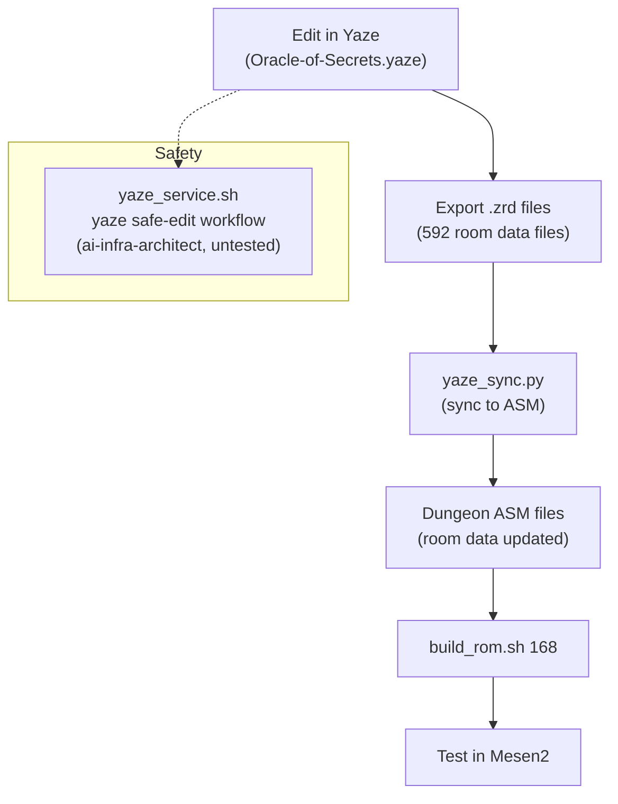

# Oracle of Secrets — Dungeon & Menu Subsystems

**Generated:** 2026-03-21
**Scope:** Dungeon architecture, collision system, water gates, minecart mechanics, and menu system layout.

---

## Dungeon Architecture (Bank $2C)

---

## Dungeon Roster

---

## Water Gate System (D4 Zora Temple)

**Key rooms:** 0x27 (main water area), 0x25 (gate control)

**Active hooks:** Fill/drain system and overlay redirect are ON. Room-entry restore (persistence on re-entry) is gated OFF.

---

## Minecart System (D6 Goron Mines)

**Status:** Basic ride mechanics work. Track table is enabled. Room invariants fixed in commit 0342300. Lift/toss physics and cart-required shutters are gated OFF and untested.

---

## Menu System Architecture (Banks $2D-$2E)

---

## HUD System

---

## Item System (Bank $2B)

---

## Yaze Workflow

Yaze is the dungeon editor. Changes to dungeon rooms require Yaze, and Yaze changes must be synced back to the ASM source.

**Key files requiring Yaze:**
- All dungeon room layouts and tile data
- Sprite placement within dungeon rooms
- Minecart track tile positions (must match ASM track table)
- Boss room dimensions and camera bounds
- Collision map data (water tiles, pits, etc.)
