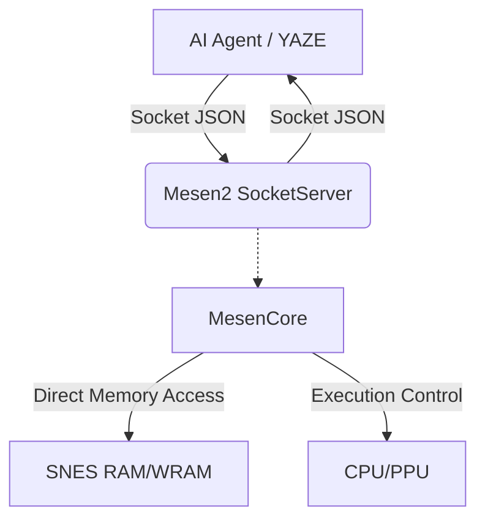

# Mesen2-OoS Architecture & Socket API

**Status**: Active / Production
**Last Updated**: 2026-01-27

This document details the architecture of the custom Mesen2 fork used for Oracle of Secrets development, focusing on the Socket API that enables AI agents and external tools (like YAZE) to control the emulator.

## 1. System Architecture

The system consists of three main components:

1.  **Mesen2-OoS (Emulator)**: A fork of Mesen2 with a custom `SocketServer` running in the core thread. It exposes game state and accepts commands via a Unix Domain Socket.
2.  **YAZE / Agent (Client)**: External tools that connect to the socket to read state (RAM, CPU) or write state (Inputs, RAM).
3.  **Bridge Layer**: `MesenCore.dylib` extensions that facilitate high-speed memory access and event broadcasting.



## 2. Connection Protocol

-   **Type**: Unix Domain Socket (macOS/Linux) or Named Pipe (Windows).
-   **Path**: `/tmp/mesen2-{PID}.sock`
-   **Format**: Line-based JSON messages (`\n` delimiter).
-   **Timeout**: Default 5s (adjustable).

### Handshake
No explicit handshake required. Clients can send `{"type": "PING"}` to verify connectivity.

## 3. Command API Reference

All commands must be valid JSON objects with at least a `type` field.

### A. Core Control

| Command | Description | Response |
| :--- | :--- | :--- |
| `PING` | Check connection | `{"success":true}` |
| `STATE` | Get emulator status | `{"success":true, "data":{...}}` |
| `PAUSE` | Pause execution | `{"success":true}` |
| `RESUME` | Resume execution | `{"success":true}` |
| `RESET` | Soft reset | `{"success":true}` |
| `FRAME` | Advance 1 frame | `{"success":true}` |
| `STEP` | Step CPU instructions | `{"success":true}` (Param: `count`) |

### B. Memory Access

| Command | Params | Description |
| :--- | :--- | :--- |
| `READ` | `addr` (hex) | Read 1 byte. |
| `READ16` | `addr` (hex) | Read 2 bytes (Word). |
| `READBLOCK` | `addr`, `len` | Read N bytes. Return: hex string. |
| `WRITE` | `addr`, `value` | Write 1 byte. |
| `WRITE16` | `addr`, `value` | Write 2 bytes. |
| `WRITEBLOCK` | `addr`, `hex` | Write hex string to address. |

**Note**: Addresses are typically physical or mapped SNES addresses (e.g., `$7E0010` for WRAM).

### C. Oracle of Secrets Specific

These commands leverage internal knowledge of the OoS ROM structure.

#### `GAMESTATE`
Returns high-level game context.
```json
{
  "type": "GAMESTATE"
}
```
**Response**:
```json
{
  "link": { "x": 1024, "y": 800, "state": 0, "direction": 2 },
  "game": { "mode": 9, "indoors": true, "room_id": 296 },
  "items": { "rupees": 100, "bombs": 10 }
}
```

#### `SPRITES`
Returns active ALTTP sprites.
```json
{
  "type": "SPRITES",
  "all": "false"  // "true" to include inactive
}
```
**Response**: Array of sprite objects `{slot, type, x, y, state}`.

### D. Debugging & Breakpoints

| Command | Params | Description |
| :--- | :--- | :--- |
| `CPU` | None | Get registers (A, X, Y, PC, P, SP). |
| `DISASM` | `addr`, `count` | Get disassembly lines. |
| `BREAKPOINT` | `action` ("add"/"remove"), `addr`, `bptype` | Manage breakpoints. |
| `TRACE` | `action` or `count` | Control trace logging or fetch trace entries (supports `count`/`offset`). |

#### TRACE control and fetch
- Control: `{"type":"TRACE","action":"start","clear":"true","format":"[Disassembly]","labels":"true","indent":"false","condition":""}`
- Status: `{"type":"TRACE","action":"status"}`
- Clear: `{"type":"TRACE","action":"clear"}`
- Stop: `{"type":"TRACE","action":"stop"}`
- Fetch: `{"type":"TRACE","count":"20","offset":"0"}` (default `count` 20, max 100)

### E. Advanced Features

-   **`COLLISION_OVERLAY`**: Draw collision mask on screen.
-   **`SAVESTATE` / `LOADSTATE`**: Slot-based state management.
-   **`SCREENSHOT`**: Capture current frame as Base64 PNG.
-   **`SUBSCRIBE`**: Listen for events (e.g., `breakpoint_hit`).

## 4. Integration Guide

### For AI Agents
Use the Python `MesenBridge` (`scripts/mesen2_client_lib/bridge.py`) or the CLI `scripts/mesen2_client.py`.

```python
from mesen2_client_lib.bridge import MesenBridge

client = MesenBridge("/tmp/mesen2-<pid>.sock")
client.send_command("GAMESTATE")
client.send_command("MEM_WATCH_WRITES", {"action": "add", "addr": "0x7E0010"})
```

### For YAZE
The `MesenDebugPanel` in YAZE uses the C++ `MesenSocketClient` to poll `GAMESTATE` and `SPRITES` at 10-60Hz to provide a real-time debugging dashboard.

## 5. Deployment

-   **Build**: Use the custom Mesen2 fork build scripts.
-   **Artifact**: `MesenCore.dylib` (macOS) / `MesenCore.dll` (Windows).
-   **Location**: Use the built fork in `/Applications/Mesen2 OOS.app` (do not install into tooling folders).
