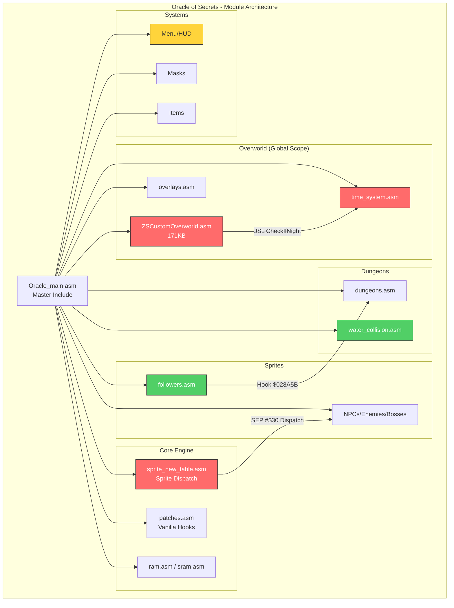
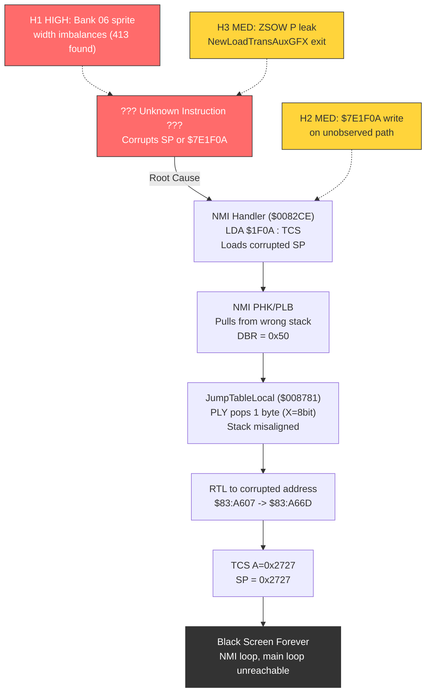
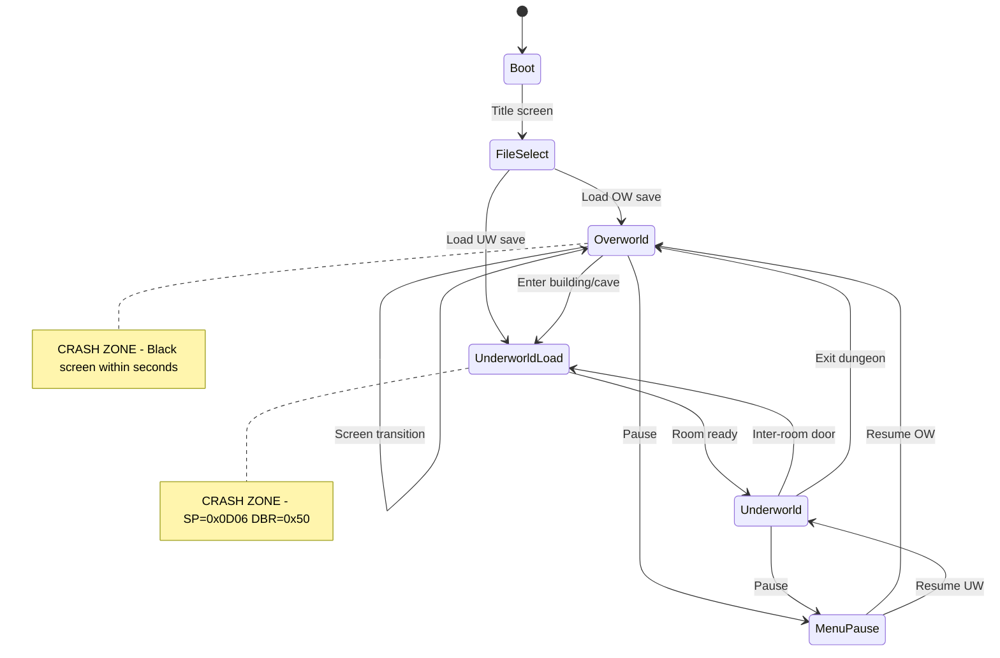

# Oracle of Secrets -- Softlock Root Cause Review & Codebase Analysis

**Author:** Claude Opus 4.5
**Date:** 2026-01-30
**Scope:** Full codebase review, softlock investigation synthesis, architecture analysis

---

## Executive Summary

After reviewing the full codebase (~50K+ lines of 65816 ASM), 30+ investigation documents, recent git history, and the debugging infrastructure, here is my assessment of the softlock situation and the project architecture.

**Two distinct crashes exist:**
- **State 1:** Overworld softlock (black screen within seconds of gameplay)
- **State 2:** File-load dungeon freeze (load save slot 2 -> freeze on dungeon entry)

Both share the same observable mechanism: **stack pointer corruption** (SP leaves `0x01xx`, lands in `0x0Dxx`), which cascades through the NMI handler into a permanent black screen.

---

## Architecture Overview

```
Oracle_main.asm
 |
 +-- namespace Oracle { }
 |    +-- Core/     (link, ram, sram, symbols, messages, patches, sprite dispatch)
 |    +-- Music/    (conditional)
 |    +-- Overworld/time_system.asm, entrances, overlays, lost_woods, etc.
 |    +-- Dungeons/ (rooms, collision, water)
 |    +-- Sprites/  (NPCs, enemies, bosses, followers)
 |    +-- Masks/    (Deku, Zora, Wolf, Minish transformations)
 |    +-- Items/    (item logic)
 |    +-- Menu/     (HUD, pause menu, song select)
 |    +-- Core/patches.asm (vanilla org hooks)
 |
 +-- [Global Scope]
      +-- Overworld/ZSCustomOverworld.asm (171KB, outside namespace)
```

**Key architectural tension:** ZSCustomOverworld operates in global scope while everything else is namespaced as `Oracle`. Cross-references between ZSOW and Oracle code require explicit `Oracle_` prefixes, and P-register contracts at these boundaries are the most fragile points in the system.

### Module Interaction Map

The per-frame execution flow creates several cross-module call chains:

1. **NMI -> HUD_ClockDisplay ($068361)** -> RunClock -> TimeSystem subroutines -> vanilla JSLs ($09B06E, $00FC62)
2. **NMI -> Sprite Dispatch ($06FFF8)** -> SEP #$30 -> JMP to individual sprite routines -> JumpTableLocal ($008781)
3. **Overworld transitions** -> ZSOW BlockGFXCheck/NewLoadTransAuxGFX -> LoadOverworldSprites_Interupt -> JSL Oracle_CheckIfNight
4. **Dungeon transitions** -> Module06/07 -> Follower hooks ($028A5B, $0289BF) -> Underworld_LoadRoom

### State Machine

```
Boot -> FileSelect -> Overworld (0x09) <-> UnderworldLoad (0x06) -> Underworld (0x07)
                                                                         |
                                                                    Inter-room (0x07/Sub 0x02)
                                                                    Intra-room (0x07/Sub 0xB8)
```

Crashes cluster around **transitions** -- entering buildings, loading dungeon saves, and overworld gameplay (which involves continuous sprite/HUD processing).

---

## Root Cause Analysis

### The Corruption Mechanism (Confirmed)

The crash chain is well-documented:

```
??? (SP corrupted) -> NMI reads $7E1F0A -> TCS loads bad SP ->
PHK/PLB pulls garbage -> DBR=0x50 -> JumpTableLocal PLY misaligns ->
RTL to garbage -> JSL into WRAM mirror -> TCS A=0x2727 -> permanent NMI loop
```

The question is: **what corrupts SP in the first place?**

### Top Suspect: The November 22 AI-Assisted Rewrite Wave

Three large commits on November 22, 2025 rewrote critical subsystems:

| Commit | Lines Changed | System |
|--------|--------------|--------|
| `8b23049` | ~2010 | Menu (Claude Code generated) |
| `93bd42b` | ~1279 | Time System |
| `d41dcda` | - | ZSOW v2->v3 port |

This is the most likely introduction window. The evidence:

1. **HUD_ClockDisplay is in the crash chain** (P=0x31 at $068361). This routine was rewritten in `93bd42b`.

2. **The menu rewrite had 5 documented regression categories** (A-E), including explicit P-register mismatches and stack corruption (PHB/PLB imbalance in Journal_CountUnlocked).

3. **The ZSOW v3 port changed include order**, which affects bank placement and could shift code across bank boundaries -- a subtle source of long-addressing bugs on the 65816.

### Specific Hypotheses (Ranked)

**H1: Width-Dependent Stack Imbalance in Bank 06 Sprite Code (HIGH)**

The static analyzer found 413 width-dependent stack imbalances. The most dangerous are in bank 06 sprite routines where PHA pushes 2 bytes (M=16-bit) but PLA pops 1 byte (M=8-bit), or vice versa. Each such mismatch shifts SP by 1 byte. In a hot path (sprite processing runs every frame for every active sprite), even a single imbalance accumulates frame-over-frame until SP leaves the `0x01xx` page.

The flagged routines -- `Oracle_Sprite_TransmuteToBomb`, `Oracle_ApplyRumbleToSprites`, `Oracle_Sprite_CheckIfLifted`, `Oracle_ForcePrizeDrop_long` -- are all in the sprite update path. The `$06ACF1` address is a PLA in the patched ROM but NOT in vanilla USDASM, which means this is an **Oracle-introduced regression**.

**H3: ZSOW P-Register Leak at NewLoadTransAuxGFX Exit (MEDIUM)**

`NewLoadTransAuxGFX` has an `.indoors` exit path that does `PLB` then `JML LoadTransAuxGFX_return` with **no explicit P restoration**. X width on this path is whatever the caller had -- if the caller entered with 16-bit X but the JML target expects 8-bit X (or vice versa), downstream code will push/pull the wrong number of bytes.

More concerning: the `JSL Decomp_bg_variableLONG` call inside the sheet loading loop does NOT manage P-register state. If `Decomp_bg_variable` (a vanilla routine) returns with different M/X than expected, the subsequent `SEP #$10` / `REP #$10` toggles will be operating from the wrong baseline.

**H2: $7E1F0A (POLYSTACKL) Written on Unobserved Path (MEDIUM)**

The earlier MEM_WATCH on $7E1F0A showed no writes during one repro attempt. But the repro conditions may not have triggered the specific code path that writes it. POLYSTACKL is documented as the "Stack pointer for polyhedral threads" -- if any Oracle code uses polyhedral threading (or any code writes to the `$7E1F0x` range for other purposes), a stray write could corrupt the NMI SP save.

**H4/H5: CheckIfNight P leak / Menu PHB imbalance (LOW)**

CheckIfNight doesn't preserve P, but its one known caller (LoadOverworldSprites_Interupt) correctly does `REP #$30` after the call. Menu PHB/PLB issues were partially addressed in Session 3 fixes. These are unlikely to be the primary cause but could be contributing factors.

### What I Think Is Actually Happening

Based on the evidence pattern, I believe the crash is a **gradual stack drift** rather than a single catastrophic corruption:

1. A sprite routine in bank 06 (likely one of the AI-rewritten paths from November) has a width mismatch between PHA and PLA.
2. Each frame that sprite is active, SP shifts by 1 byte.
3. After N frames, SP has drifted far enough that either:
   - SP wraps around or exits the `0x01xx` page directly, OR
   - A routine's PLA/PLB/PLP pulls corrupt data from the wrong stack location, and that data eventually reaches `$7E1F0A` via the NMI save/restore mechanism

This explains why:
- The crash is **non-deterministic** (depends on which sprites are active)
- Static fixes to specific hooks don't help (the corruption source is upstream in the sprite frame loop)
- It correlates with the November rewrite window (new sprite interaction code)

---

## Recommended Next Steps

### 1. Dynamic SP Polling (Highest Priority)

The static analysis is exhausted. You need runtime capture. The `repro_stack_corruption.py` script with `--strategy polling` is the right tool. Run it against both State 1 and State 2:

```bash
python3 scripts/repro_stack_corruption.py --strategy polling --frames 600 --output /tmp/sp_blame.json
```

This will capture the exact frame and PC where SP first leaves `0x01xx`.

### 2. Module Isolation (Parallel Track)

While waiting for dynamic capture results, use the module isolation flags:

```
Priority order: Sprites -> Overworld -> Menu -> Masks -> Items -> Music
```

If disabling Sprites eliminates the crash, the root cause is in sprite code. Then progressively re-enable sprite files to narrow to the specific file.

### 3. Targeted Binary Diff at $06ACF1

The `$06ACF1` PLA byte exists in the patched ROM but not in vanilla USDASM. This is a concrete lead:

```bash
# Disassemble the patched ROM around $06ACF1
python3 scripts/mesen2_client.py disassemble --addr 0x06ACD0 --count 40
```

Find out which Oracle patch moved code to this address and whether the PLA is intentional or a side-effect of code relocation.

### 4. ZSOW Exit P Contracts

Add explicit `REP #$30` (or `SEP #$30` as appropriate) before every RTS/JML exit in `NewLoadTransAuxGFX` and `BlockGFXCheck`. This is a low-risk change that closes the H3 hypothesis.

### 5. Git Bisect Against November 22

If the above doesn't yield results:

```bash
git bisect start HEAD <commit-before-nov-22>
git bisect run python3 scripts/bisect_softlock.py
```

This will identify the exact commit that introduced instability.

---

## Architectural Observations

### Strengths
- The PHP/PLP contract in `HUD_ClockDisplay` is well-implemented
- The sprite dispatch (`sprite_new_table.asm`) correctly forces `SEP #$30` before dispatch
- The debugging infrastructure (Mesen2 fork, socket API, Python scripts) is impressively mature
- Module isolation flags are a smart design for bug hunting
- Documentation is thorough -- the investigation trail is well-preserved

### Risks
- **ZSOW in global scope** creates a namespace boundary where P-register contracts are hardest to enforce
- **No automated P-register contract checking at build time** -- the static analyzer runs post-hoc, not as a build gate
- **AI-generated rewrites of critical subsystems** introduced regressions that are difficult to catch without runtime validation (the 65816's variable-width registers make static analysis fundamentally incomplete)
- **The `$06ACF1` patched-ROM PLA** is a smoking gun that needs immediate investigation -- it's a concrete byte-level difference between vanilla and patched that lies in the sprite crash chain

### Suggestion: Build-Time P-Register Contracts

Consider adding asar macros that enforce P-register state at hook boundaries:

```asm
macro assert_p_state(expected)
  ; In debug builds, emit code that checks P register
  ; and triggers BRK if unexpected
  !if !DEBUG_BUILD
    PHP : PLA : AND #$30 : CMP #<expected>
    BEQ +
    BRK #$FF  ; P-register contract violation
    +
  !endif
endmacro
```

This would catch width mismatches at runtime during testing rather than requiring manual trace analysis.

---

## Diagrams (Mermaid Source)

Render these via mermaid.live, VS Code mermaid plugin, or any mermaid-compatible viewer.

### Module Architecture Diagram



### Softlock Corruption Chain



### Game Mode State Machine



---

## Bottom Line

The root cause is almost certainly a **width-dependent stack imbalance in the sprite processing path** (bank 06), likely introduced during the November 2025 AI-assisted rewrite wave. The `$06ACF1` PLA byte that exists in the patched ROM but not in vanilla is the strongest concrete lead. Dynamic SP capture will close the investigation -- the static analysis has done its job identifying the suspects, but the 65816's modal register architecture means only runtime observation can identify the actual faulting instruction.

---

## References

| Document | Path |
|----------|------|
| Root Cause Analysis | `Docs/Issues/OverworldSoftlock_RootCause.md` |
| Investigation Synthesis | `Docs/Issues/OverworldDungeon_Softlock_RootCause_Investigation.md` |
| Building Entry Debug | `Docs/Issues/BuildingEntry_BlackScreen_Debug.md` |
| Investigation Plan | `Docs/Issues/OverworldSoftlock_Plan.md` |
| Handoff Notes | `Docs/Issues/OverworldSoftlock_Handoff.md` |
| Repro Script | `scripts/repro_stack_corruption.py` |
| Static Analyzer | `~/src/hobby/z3dk/scripts/oracle_analyzer.py` |
| Module Flags | `Config/module_flags.asm` |
