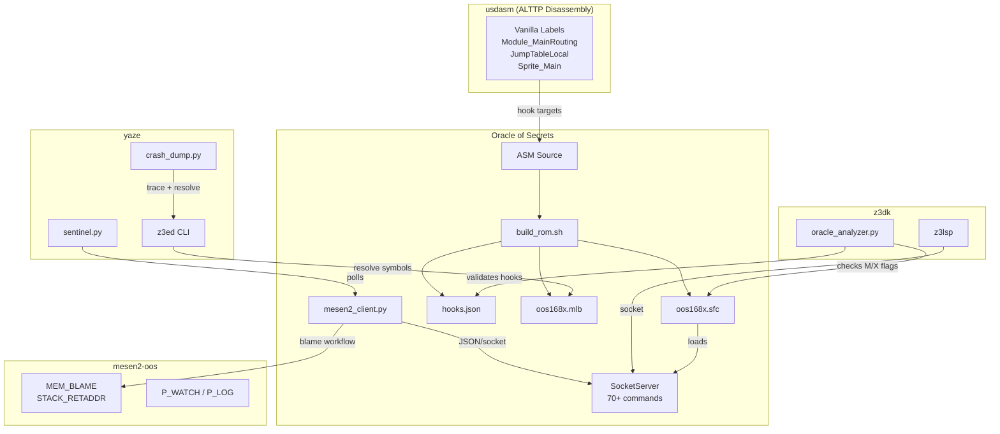
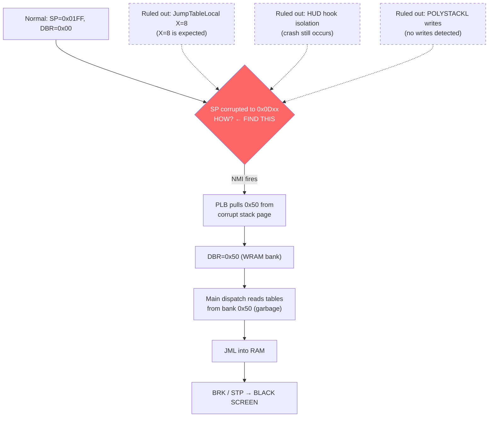
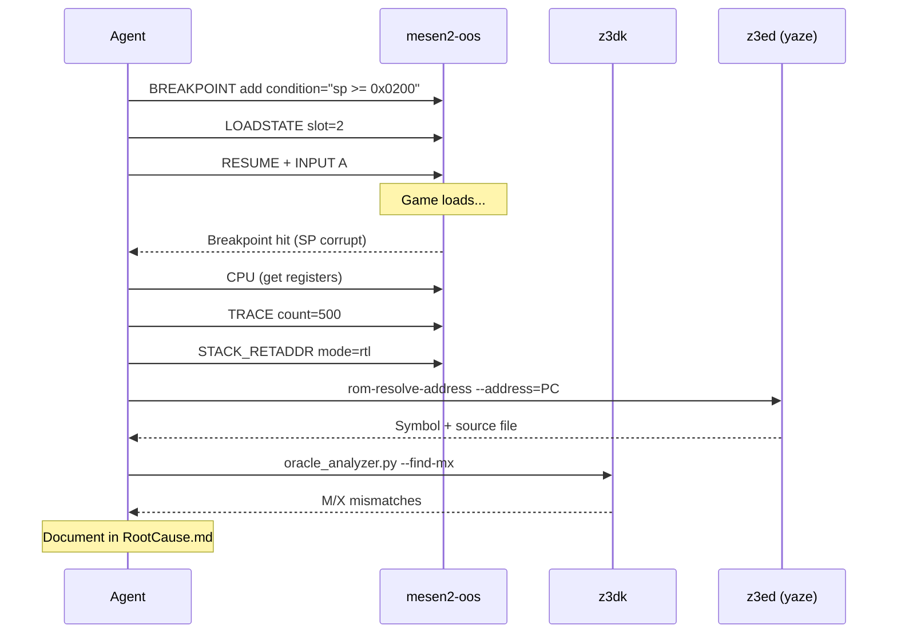

# Root Cause Investigation Handoff

**Date:** 2026-01-29
**Priority:** P0 - Game-breaking black screen softlock
**Status:** Root cause mechanism identified, definitive attribution NOT yet captured
**For:** Next agent using yaze/z3ed, z3dk, mesen2-oos tooling

---

## Executive Summary

Oracle of Secrets has an intermittent black screen bug on dungeon/overworld loads. Five days of investigation across multiple agent sessions have narrowed the mechanism but NOT identified the definitive root cause. The key correction made on 2026-01-29 is that **JumpTableLocal with X=8-bit is EXPECTED behavior** (not a bug), and the real problem is **stack pointer corruption** that causes DBR drift during NMI, leading to main dispatch jumping into RAM.

**What's known:** The crash chain, the mechanism, the symptoms.
**What's NOT known:** What instruction corrupts SP to the 0x0Dxx page.
**What's ready:** All tooling to capture the answer.

---

## Crash Mechanism (Confirmed)

```
Normal state: SP=0x01FF, DBR=0x00
         |
    [UNKNOWN: SP jumps to 0x0Dxx page]
         |
    NMI fires at 0x0080C9
    PHD / PHB / PHK / PLB
    PLB pulls 0x50 from corrupt stack → DBR=0x50
         |
    Main dispatch at 0x0080B5
    LDA $8061,Y  (banked by DBR=0x50, not 0x00)
    Reads garbage pointer from WRAM bank → 0x005200
         |
    JML [$0003] → jumps into RAM
    BRK at 0x000BB5 → further stack corruption
    RTS to 0x00B7B5 → STP instruction
         |
    CPU halted, NMI repeats forever → BLACK SCREEN
```

### Key Evidence

| Capture | Value | Meaning |
|---------|-------|---------|
| PC at crash | `0x000BB5` | CPU is in RAM (not ROM) |
| SP at crash | `0x0D08` | Stack page wrong (should be 0x01xx) |
| DBR at crash | `0x50` | Data bank = WRAM mirror (should be 0x00) |
| P at crash | `0xB4` | M=8, X=8, carry set |
| `$7E0010` (GameMode) | `0x07` | Dungeon mode (expected) |
| Main dispatch pointer | `0x005200` | Points into RAM (garbage) |

### Critical Correction (2026-01-29)

**Previous hypothesis (WRONG):** JumpTableLocal ($008781) called with X=8-bit causes PLY to pop 1 byte instead of 2, corrupting the return address.

**Correction:** JumpTableLocal's stack math actually REQUIRES X=8-bit:
- With X=8: PLY pops 1 (low byte), then `REP #$30` makes `PLA` pop 2 (high+bank) → total 3 bytes (correct JSL return size)
- With X=16: PLY pops 2, then PLA pops 2 → total 4 bytes (WRONG)

**The X=8-bit state at JumpTableLocal is intentional.** Focus should be on what corrupts SP to the 0x0Dxx page.

### P_WATCH Evidence

P_WATCH (depth 500) captured `SEP #$30` at `PC=01:D825` setting X=8-bit. The routine at `01:D802`:
```asm
01:D802 CMP #$0004
01:D807 SEP #$30
01:D809 JSL $07:EDF9
01:D81B REP #$30
01:D825 SEP #$30     ; ← sets X=8 before return
01:D827 RTL
```
This routine exits with X=8-bit. This is expected for the sprite dispatch path, not the root cause.

### DBR=0x50 Source

Trace analysis found exactly two PLB instructions in the capture:
- `0x008227` (Interrupt_Unused exit) with DB=0
- `0x0080D6` (NMI prologue) with DB=0x50

The NMI prologue does `PHK / PLB` which should produce DBR=0x00. But because SP is already in the 0x0Dxx page, PHK pushes to the wrong stack location, and PLB pulls a different (wrong) byte → DBR=0x50.

**Conclusion:** SP corruption happens BEFORE NMI. DBR=0x50 is a downstream symptom.

### Ruled Out

- POLYSTACKL (`$7E1F0A`) write watch: **no writes** during repro. TCS/Polyhedral restore path is not the source.
- HUD hook isolation: patching `$06:8361` to vanilla `JSL $09B06E` did NOT fix the crash.
- ColorBgFix PHP/PLP: partial mitigation only, crash still occurs.

---

## What Needs to Happen Next

### Step 1: Watch SP for the Corruption Write

The missing piece is: **what instruction writes SP to the 0x0Dxx range?**

On the 65816, SP can only change via:
- `TCS` (Transfer C to SP) - copies A register to SP
- `TXS` (Transfer X to SP, emulation mode only)
- Push/pull instructions (decrement/increment SP by 1 or 2)
- Interrupt entry/exit (RTI restores SP from stack)

**Approach 1: MEM_WATCH on SP itself**

SP is mapped to `$7E01FC-$7E01FE` in WRAM but is NOT a regular memory location - it's a CPU register. MEM_WATCH_WRITES tracks memory writes, not register changes. You need a **breakpoint with condition** instead:

```bash
# Break when SP leaves the 0x01xx page
mesen2ctl breakpoint --action add --addr 0x000000 --bptype exec \
  --condition "sp >= 0x0200"

# Or: break on TCS instruction (opcode 0x1B)
mesen2ctl breakpoint --action add --addr 0x000000 --bptype exec \
  --condition "opcode == 0x1B && a >= 0x0200"
```

**Approach 2: P_WATCH + frame-by-frame**

Load state 1 (overworld softlock), advance frame by frame, check SP each frame:
```bash
for i in $(seq 1 600); do
  mesen2ctl frame
  SP=$(mesen2ctl cpu | jq -r '.sp')
  if [ "$SP" -gt "511" ]; then  # 0x01FF = 511
    echo "SP CORRUPT at frame $i: $SP"
    mesen2ctl cpu
    mesen2ctl blame --watch-id 1
    break
  fi
done
```

**Approach 3: Use the automated repro script**

```bash
cd ~/src/hobby/oracle-of-secrets
python3 scripts/repro_stack_corruption.py --output /tmp/blame_report.json
```

This script watches `$01FC-$01FE`, loads state 1 (overworld softlock), and captures blame when the breakpoint at `$83:A66D` triggers. However, note that MEM_WATCH on `$01FC` tracks MEMORY writes to that address, not SP register changes. You may need to modify the script to use a conditional breakpoint on SP instead.
**Correction (2026-01-30):** State 2 is the file-load dungeon freeze and is tracked separately under the building-entry/file-load bug.

### Step 2: Trace the TCS/TXS Chain

Once you know WHICH frame SP changes, capture the TRACE around that point:
```bash
mesen2ctl trace --count 500
```

Look for `TCS` (opcode `0x1B`) or stack overflow (SP wrapping from `0x0100` to `0x0Dxx` through excessive pushes).

### Step 3: Map PC to Oracle Source

Use symbol resolution:
```bash
# Via mesen2ctl
mesen2ctl blame --addr 0x7E01FC --resolve

# Via z3ed
~/src/hobby/yaze/build_ai/bin/Debug/z3ed rom-resolve-address \
  --address=<PC> --rom=Roms/oos168x.sfc --format=json
```

### Step 4: Static Analysis Cross-Reference

Once you have the routine name:
```bash
# Check if z3dk flags it
cd ~/src/hobby/z3dk
python3 scripts/oracle_analyzer.py \
  --rom ~/src/hobby/oracle-of-secrets/Roms/oos168x.sfc \
  --check-hooks --find-mx

# Search for the routine in ASM
cd ~/src/hobby/oracle-of-secrets
grep -rn "RoutineName" --include="*.asm"
```

### Step 5: Document Root Cause

Update `Docs/Issues/OverworldSoftlock_RootCause.md` with:
- Exact PC that corrupts SP
- Source file and line number
- The instruction (TCS with what A value? Stack overflow from what?)
- MEM_BLAME or TRACE output as evidence

---

## System Architecture Diagram


<details><summary>Mermaid source</summary>



</details>

## Corruption Chain Diagram


<details><summary>Mermaid source</summary>



</details>

## Investigation Workflow Diagram


<details><summary>Mermaid source</summary>



</details>

---

## Tool Reference (Quick)

### mesen2-oos Commands for This Investigation

| Command | Purpose | Example |
|---------|---------|---------|
| `BREAKPOINT` | Conditional break on SP | `--condition "sp >= 0x0200"` |
| `CPU` | Get all registers | Shows PC, SP, P, A, X, Y, K, DBR |
| `TRACE` | Execution history | `--count 500` (recent instructions) |
| `MEM_WATCH_WRITES` | Track memory writes | `addr=0x7E01FC size=3 depth=500` |
| `MEM_BLAME` | Who wrote to address | Returns PC, opcode, SP, cycle |
| `STACK_RETADDR` | Decode return addresses | `mode=rtl count=8` |
| `P_WATCH` | Track P register changes | `action=start depth=1000` |
| `P_LOG` | Get P change history | `count=100` |
| `SYMBOLS_RESOLVE` | Address to label | `addr=0x068361` |

### z3dk Analysis Commands

```bash
# Full static analysis
python3 ~/src/hobby/z3dk/scripts/oracle_analyzer.py \
  --rom Roms/oos168x.sfc --check-hooks --find-mx

# ROM integrity
python3 ~/src/hobby/z3dk/scripts/oracle_validate.py \
  --rom Roms/oos168x.sfc --check-rooms --check-tile16

# Run tests
cd ~/src/hobby/z3dk && pytest tests/test_mx_flag_analysis.py -v
```

### z3ed Symbol Resolution

```bash
# Resolve address to symbol
~/src/hobby/yaze/build_ai/bin/Debug/z3ed rom-resolve-address \
  --address=0x068361 --rom=Roms/oos168x.sfc --format=json

# Dump sprites in a room
~/src/hobby/yaze/build_ai/bin/Debug/z3ed dungeon-list-sprites \
  --room=0x104 --rom=Roms/oos168x.sfc

# Static call graph
python3 ~/src/hobby/yaze/scripts/ai/code_graph.py \
  ~/src/hobby/oracle-of-secrets writes 7E0010
```

### Sentinel + Crash Dump (Autonomous Monitoring)

```bash
# Start watchdog
python3 ~/src/hobby/yaze/scripts/ai/sentinel.py \
  --z3ed ~/src/hobby/yaze/build_ai/bin/Debug/z3ed \
  --rom ~/src/hobby/oracle-of-secrets/Roms/oos168x.sfc &

# Reports appear in crash_reports/
```

---

## Repro Steps

1. Build ROM: `cd ~/src/hobby/oracle-of-secrets && ./scripts/build_rom.sh 168`
2. Launch Mesen2: `~/src/hobby/mesen2-oos/bin/osx-arm64/Release/osx-arm64/publish/Mesen`
3. Load `Roms/oos168x.sfc`
4. Load save state slot 1 (overworld softlock)
5. Press A to start game
6. Black screen occurs within seconds

**Save state location:** `/Users/scawful/Documents/Mesen2/SaveStates/oos168x_2.mss`

---

## Hypotheses (Ordered by Likelihood)

### H1: TCS with Corrupt A Value (HIGH)
A `TCS` instruction (opcode `0x1B`) transfers A to SP. If A contains a large value (e.g., `0x0D08`), SP jumps to the wrong page. This could happen in:
- A custom Oracle routine that uses TCS for stack manipulation
- The main loop dispatch path if A is loaded from corrupted data
- An interrupt handler that restores SP from a corrupted save location

**How to test:** Set breakpoint on `TCS` with condition `a >= 0x0200`.

### H2: Stack Overflow via Excessive Pushes (MEDIUM)
If a loop pushes without pulling, SP wraps from `0x0100` through `0x00FF` into the `0x0Dxx` range. The 65816 stack wraps within the current stack page in emulation mode, but in native mode (which ALTTP uses), SP can go anywhere.

**How to test:** Set breakpoint with condition `sp >= 0x0200` and check if the preceding instruction is a push.

### H3: Oracle Hook P State Leak Cascading to SP Corruption (MEDIUM)
An Oracle hook (time/menu/palette) leaks P state → wrong A/X/Y width → subsequent TCS uses wrong-width A → SP corrupted.

**How to test:** P_WATCH captures show which hooks change P. Cross-reference with TCS sites.

### H4: Direct Stack Memory Overwrite (LOW)
A stray `STA $0100,X` or similar indexed write lands on the stack page. While MEM_WATCH on `$01FC-$01FE` was set up, it may not have been active during the exact corruption frame.

**How to test:** MEM_WATCH_WRITES on the full stack page `$0100-$01FF`.

---

## Z3DK Analyzer Findings (Existing)

The analyzer found 12 routines with M/X call site mismatches. These are worth investigating as potential P-state leak sources:

| Routine | Mismatches | Flag Issue |
|---------|-----------|------------|
| `Oracle_Overworld_DrawMap16_Persist` | 6 sites | M+X mismatch |
| `Oracle_Link_HandleMovingAnimation_FullLongEntry` | 5 sites | X mismatch |
| `Oracle_UpdateGbcPalette` | 4 sites | M+X mismatch |
| `Oracle_Sprite_DamageFlash_Long` | 4 sites | X mismatch |
| `Oracle_Sparkle_PrepOAMFromRadial` | 3 sites | M+X mismatch |
| `Oracle_HUD_Update` | 2 sites | M mismatch |
| `Oracle_CustomRoomCollision` | 1 site | M mismatch |

These may not directly cause SP corruption, but any of them could cascade into wrong register widths that affect TCS behavior downstream.

---

## File Locations

### Evidence & Logs
| File | Content |
|------|---------|
| `Docs/Issues/OverworldSoftlock_RootCause.md` | Root cause doc (TBD section unfilled) |
| `Docs/Issues/OverworldSoftlock_Handoff.md` | Previous handoff (updated 2026-01-29) |
| `Docs/Issues/OverworldSoftlock_ActionPlan.md` | Execution plan with commands |
| `Docs/Tooling/Z3DK_Analyzer_Findings.md` | Static analysis results |
| `~/.context/.../save2_jump_table_rootcause_20260129.md` | JumpTableLocal correction |
| `~/.context/.../loadfile_dbr_dispatch_20260129.md` | DBR=0x50 root cause trace |
| `~/.context/.../save2_capture_20260127.md` | Save state 2 captures (file-load dungeon freeze) |
| `~/.context/.../ralph_overnight_handoff_20260128.md` | Ralph loop results |

### Tooling
| Tool | Location |
|------|----------|
| `mesen2_client.py` | `oracle-of-secrets/scripts/` |
| `repro_stack_corruption.py` | `oracle-of-secrets/scripts/` |
| `mesen2ctl` | `mesen2-oos/tools/` |
| `oracle_analyzer.py` | `z3dk/scripts/` |
| `z3ed` | `yaze/build_ai/bin/Debug/` |
| `sentinel.py` | `yaze/scripts/ai/` |
| `crash_dump.py` | `yaze/scripts/ai/` |
| `code_graph.py` | `yaze/scripts/ai/` |

### Tests
| Suite | Location | Status |
|-------|----------|--------|
| `test_stack_attribution.py` | `mesen2-oos/` | 12/12 pass |
| `test_socket_api_full.py` | `mesen2-oos/` | All pass |
| `test_mx_flag_analysis.py` | `z3dk/tests/` | 15/15 pass |
| Smoke tests | `oracle-of-secrets/` | `boot_test` pass, 3 tests skipped (missing states) |

---

## Ideas for Grounding the Investigation

### Using mesen2-oos Features

1. **Conditional breakpoints on CPU registers** - The socket API supports `condition` strings that can reference `sp`, `a`, `x`, `y`, `p`, `pc`, `dbr`. Use `sp >= 0x0200` to catch the exact moment SP leaves the valid page.

2. **TRACE with frame correlation** - After catching the breakpoint, the TRACE buffer contains the last N instructions with full register state. This gives you the exact instruction before SP corruption.

3. **P_WATCH for register state tracking** - P_WATCH captures every SEP/REP/PLP instruction with before/after P values. Cross-reference the P state at the TCS instruction to determine if A was in the wrong bit-width.

4. **MEM_BLAME opcode field** - The opcode field in MEM_BLAME responses tells you exactly which instruction (STA, PHA, TCS, etc.) wrote to an address. If you watch the stack page, you can see if any unexpected instructions write there.

5. **BATCH commands** - Execute multiple commands atomically to capture CPU + TRACE + STACK_RETADDR in a single response, preventing state drift between captures.

### Using z3dk

1. **oracle_analyzer.py** already flags 12 M/X mismatches. Once the root cause PC is known, check if it's one of these flagged routines.

2. **Add TCS validation** - Extend the analyzer to track TCS call sites and verify A is in a valid range before the transfer. This would catch the bug pattern at build time.

3. **code_graph.py** can find all routines that call the corrupting function, giving you the full call chain.

### Using z3ed / yaze

1. **Symbol resolution** maps raw PCs to Oracle source files. Use `rom-resolve-address` with the PC from the breakpoint to immediately identify the ASM file and line.

2. **sentinel.py** can run in the background during manual testing. It auto-captures when softlock conditions are detected.

3. **crash_dump.py** generates markdown reports with annotated traces (symbol names, source lines). Run `monitor` mode during the investigation for automatic report generation.

4. **profiler.py** can identify if the corruption routine is a hot path (frequently executed) or a rare edge case.

---

## Socket Discovery

All tools use `MESEN2_SOCKET_PATH` for socket discovery:

```bash
export MESEN2_SOCKET_PATH=/tmp/mesen2-<pid>.sock
```

Fallback: glob `/tmp/mesen2-*.sock` sorted by modification time (most recent first).

**DO NOT use `MESEN2_SOCKET`** (deprecated).

---

## Build Quick Reference

```bash
# Oracle ROM
cd ~/src/hobby/oracle-of-secrets
./scripts/build_rom.sh 168

# Mesen2 fork
cd ~/src/hobby/mesen2-oos
make clean && make
# Copy dylib to app bundle:
cp bin/osx-arm64/Release/MesenCore.dylib \
   bin/osx-arm64/Release/osx-arm64/publish/Mesen.app/Contents/MacOS/

# z3dk
cd ~/src/hobby/z3dk
mkdir -p build && cd build && cmake .. && make -j8

# yaze (z3ed)
cd ~/src/hobby/yaze
cmake --preset mac-dbg && cmake --build build -j8
```
