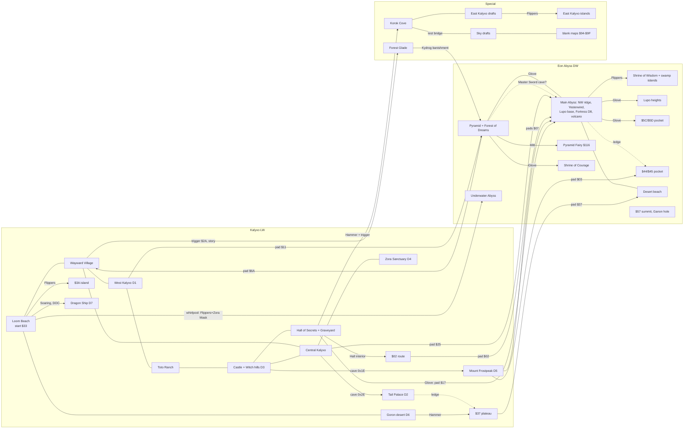

# Oracle of Secrets overworld: regions, connections, gates

Date: 2026-09-27. ROM: `Roms/oos168.sfc` (SHA-1 `b143612a92d3e51ace4d640919b709f4e33e8592`), read from a scratch copy.
Read-only static analysis. No build, no emulator, no repo edits. Companion data: `overworld_regions.csv` (one row per map, 160 rows).

Tags: **VERIFIED** = read directly from ROM data or code (command or address given). **INFERRED** = derived by the
connectivity model, by room-ID adjacency, or from docs. Nothing here is runtime-tested in Mesen2.

## 0. Method (short)

1. **Tile grids (VERIFIED).** All 160 screens rebuilt as 32x32 tile16 grids by sweeping
   `z3ed overworld-find-tile --tile 0x000..0xFFF` (every screen came back complete, 0 gaps).
   Tool trap: `--tile` parses its argument as hex, so `--tile 16` means `0x16`. Pass `0x..` values.
2. **Tile types (VERIFIED).** Tile16 words from PC `0x1E8000`; `word & 0x1FF` indexes `OverworldTileTypes` PC `0x71459`
   (the same mask the game uses at `$00886A`).
3. **Sizes and parents (VERIFIED).** Area-size table PC `0x1788D` and parent table `Pool_Overworld_ActualScreenID_New`
   PC `0x140998`. Both match `z3ed overworld-describe-map` for all 160 maps. No wide or tall areas exist.
4. **Walking transitions (VERIFIED code).** `OverworldHandleTransitions` (`Overworld/ZSCustomOverworld.asm:4693`) adds
   ±1 / ±8 screens and then loads the parent. So a walking neighbor is the grid neighbor. Special areas run the same
   routine after `SpecialOverworld_CheckForReturnTrigger` (`:5632-5660`), so special maps connect by edges too.
   `z3ed overworld-export-graph` is not usable for this: it reads vanilla transition tables and adds all grid neighbors.
5. **Gate semantics (VERIFIED, bytes equal vanilla).** Lift levels `$07D375`: type `0x52` small gray rock and `0x55` big gray
   rock need Glove (1); `0x53` small black rock and `0x56` big black rock need Mitt (2); `0x50/0x51` bush and `0x54` sign need
   nothing. Hammer peg = map16 `0x021B` exactly (`CMP #$021B` at `$1BBDD1`). `0x57` = bonk rocks (Boots). `0x08` = deep water.
   Oracle ASM has no hooks on these tables (grep).
6. **Zones (INFERRED model).** Flood fill on the 8x8 grid: free cells, solid cells, deep water (Flippers), rocks/pegs/bonk
   rocks (item), pits, and one-way ledges (`0x28` north, `0x29` south per `$07BFF8`; `0x2A/0x2B` west/east naming INFERRED).
   Warp pads, the whirlpool, special-area triggers, and cave pairs were added as graph edges.
7. **Model limits.** No sprites/NPC blockers, overlays, story flags, Roc's Feather or Hookshot crossings. Several plateaus
   have no tile-level way in (stairs are typed as ledge `0x29` over wall `0x02`); they are marked "entry unresolved".

## 1. Region map

Region codes per screen (`*` = child quadrant of a large area). Names come from area signs (VERIFIED `z3ed message-read`),
`decisions.org` (DECIDED), labels, or inference.

```
LW (Kalyxo)   0      1      2      3      4      5      6      7
0          00RAN  01RAN* 02HSR  03FRP  04FRP  05FRP  06FRP  07FRP
1          08RAN* 09RAN* 0ARAN  0BCAS  0CCAS* 0DCAS  0EHOS  0FHOS
2          10WST  11WST  12WST  13CAS* 14CAS* 15CAS  16CAS  17HOS
3          18WST  19WST* 1ACEN  1BCEN  1CCEN  1DCEN  1EZOR  1FZOR*
4          20WST* 21WST* 22WAY  23WAY  24WAY* 25CEN  26ZOR* 27ZOR*
5          28WST  29WST  2AWAY  2BWAY* 2CWAY* 2DCEN  2ETPL  2FTPL
6          30DSD  31DSD* 32BCH  33BCH  34BCH* 35BCH  36GOR  37GOR*
7          38DSD* 39DSD* 3ABCH  3BBCH* 3CBCH* 3DBCH  3EGOR* 3FGOR*

DW (Abyss)    0      1      2      3      4      5      6      7
0          40INT  41INT* 42NWR  43VOL  44VOL  45VOL  46VOL  47VOL
1          48INT* 49INT* 4ANWR  4BLUP  4CLUP* 4DLUP  4EVOL  4FVOL
2          50INT  51INT  52NWR  53LUP* 54LUP* 55VOL  56VOL  57VOL
3          58INT  59INT* 5AYST  5BYST  5CYST  5DYST  5EFOS  5FFOS*
4          60INT* 61INT* 62YST  63YST  64YST* 65YST  66FOS* 67FOS*
5          68INT  69INT  6AINT  6BYST* 6CYST* 6DYST  6EFOS  6FFOS
6          70UWA  71UWA* 72UWA  73UWA  74UWA* 75UWA  76DSB  77DSB*
7          78UWA* 79UWA* 7AUWA  7BUWA* 7CUWA* 7DUWA  7EDSB* 7FDSB*

SW (special)  0      1      2      3      4      5      6      7
0          80FGL  81KOR  82KOR* 83EKX  84SKY  85SKY  86SKY  87SKY
1          88---  89KOR* 8AKOR* 8BEKX  8CSKY  8DSKY  8ESKY  8FSKY
2          90EKX  91EKX  92EKX  93EKX  94---  95---  96---  97---
3          98EKX  99EKX  9AEKX  9BEKX  9C---  9D---  9E---  9F---
```

Large areas (VERIFIED): LW `$00 $0B $18 $1E $23 $30 $33 $36`; DW `$40 $4B $58 $5E $63 $70 $73 $76`; SW `$81`. All others are small.

### 1a. Light World (Kalyxo)

| Code | Region | Maps | Content (entrance ID -> room) | Tag |
|---|---|---|---|---|
| BCH | Loom Beach (south coast) | 32, 33L, 35, 3A, 3D | Link's House `0x01`->$104; Beach Cave `0x1A`; tiny-house trigger ($33 7,18); whirlpool on $3D; $3A island (sign "grow some gills") | V data |
| WAY | Wayward Village | 23L, 22, 2A | Village ($23 sign "Village of Wayward"): tavern, shop, library, Mayor; village hole `0x80`->$FE; $2A Forest Crossroads (sign "Up: Great Maku Tree"), Forest Glade trigger ($2A 18,6) | V |
| CEN | Central Kalyxo | 25, 1A, 1B, 1C, 1D, 2D | Kalyxo Field caves `0x21-0x23`, warp pad $25 (9,11); archery; castle lake; Tail Pond `0x6B` Mask shop, Tail Palace cave `0x2E` | V |
| WST | West Kalyxo | 10, 11, 12, 18L, 28, 29 | D1 Mushroom Grotto `0x26`->$4A; Toadstool Woods (tree-house trigger on $20 31,1); warp pad $11 (8,17); Lost Woods $29 maze | V |
| RAN | Toto Ranch / Hotel Kaly | 00L, 0A | Ranch houses `0x3E/0x3F/0x4B` (signs say "Toto Ranch"); Hotel Kaly `0x60` | V |
| CAS | Kalyxo Castle and Witch hills | 0BL, 0D, 15, 16 | D3 `0x2B/0x28/0x2A/0x32/0x0A`; Witch shop `0x4C`; Deluxe Fairy, Rock Heart Piece cave `0x51` | V |
| HOS | Hall of Secrets and Graveyard | 0E, 0F, 17 | Hall of Secrets `0x02`->$12; Korok Cove waterfall trigger ($0F 22-24,1); warp pad $17 (21,25) | V |
| ZOR | Zora Sanctuary / Zora River | 1EL | D4 Zora Temple `0x25`->$28; Zora Princess house `0x45` | V |
| TPL | Tail Palace plateau | 2E, 2F | D2 `0x15`->$5F; only entry = Tail Palace cave `0x2E`<->`0x2F` (rooms E6/E7) | V data / INFERRED cave |
| GOR | Goron desert | 36L | D6 Goron Mines `0x27`->$98; Mines shed; $37 plateau with warp pad (22,6) and `0x5E`->$115 | V |
| FRP | Mount Frostpeak (signs "Mount Frostpeak") | 03, 04, 05, 06, 07 | D5 Glacia Estate `0x34`->$DB; pads $03 (10,5), $07 (7,5),(25,6); snow caves | V |
| HSR | Hall of Secrets pyramid route | 02 | Plateau reached through the Hall interior (rooms $12->$11); custom 2x2 warp pad (15-16,6-7) | V data / INFERRED route |
| DSD | Dragon Ship dock | 30L | D7 `0x35`->$D6; no walk or swim link to the mainland (ocean touches only the dock) | V data; Soaring = DOC |

### 1b. Dark World (Eon Abyss / Yesterwind)

| Code | Region | Maps | Content | Tag |
|---|---|---|---|---|
| INT | Temporal Pyramid + Forest of Dreams (intro chunk) | 40L, 50, 51, 58L, 68, 69, 6A | Shrine of Origins `0x76`->$05; pedestal; Pyramid Fairy `0x63`->$116 (Mitt ring); S3 `0x0C`->$53 on $50 (Glove); $51 sign "Up Pyramid / Down Forest of Dreams / Right Lupo Mountain"; return pad $6A (19,11) | V |
| NWR | Northwest ridge | 42, 4A, 52 | Landing of LW $02 pad; water on $4A | V |
| LUP | Lupo Mountain | 4BL, 4D | S2 Shrine of Power `0x09`->$84, `0x0B`->$83 (main zone), `0x03`->$76, `0x05`->$86 (small pockets); Lupo heights ($4C/$4D/$54, Glove) with `0x5A`, `0x66`, Heart Piece cave `0x6E` | V |
| VOL | Volcano / Lava Lands | 43-47, 4E, 4F, 55-57 | Lava cave `0x4F`<->`0x52`; Master Sword cave exit `0x19`->$24 on $46; $57 summit: Final Boss Route `0x24`->$15 and Ganon hole `0x7B`->$00 | V |
| YST | Yesterwind village and swamp | 5A-5D, 62, 63L, 65, 6D | Village of Yesterwind ($63, sign $AF); Shrine of Wisdom `0x33`->$C9 (on the $64 quadrant); Dream Hut door `0x68`->$11A on $5D; landing of LW $25 pad on $65 | V |
| FOS | Fortress of Secrets (D8) | 5EL, 6E, 6F | D8 `0x37`->$0C (no tile gate at the door); Mitt row $67 (9-12,16) | V |
| DSB | Abyss desert beach | 76L | Landing of LW $37 pad; `0x41`->$117, `0x53`->$11C | V |
| UWA | Underwater Abyss | 70L, 72, 73L, 75, 7A, 7D | Whirlpool landing $7D; placeholder doors (`0x1D 0x3C 0x54 0x59 0x62 0x6E 0x3D`); `0x29`->$60 on $7A | V; no tile exit |

### 1c. Special world ($80-$9F)

| Code | Region | Maps | Entry | Tag |
|---|---|---|---|---|
| FGL | Forest Glade (left half of $80) / Tree house (right half) | 80 | Exit `$180` from $2A trigger; exit `$181` from $17 (26,7) and $20 (31,1). Half-map camera bounds (`SetupSpecialCameraBounds`) | V code |
| KOR | Korok Cove | 81L | Exit `$182` from $0F (22-24,1), arrival (670,1000) on $89. Return trigger tiles $89 (8-11,31) | V |
| EKX | East Kalyxo (doc plan, drafts) | 83, 8B, 90-93, 98-9B | Walk from Korok Cove: $82->$83 at rows 17-18 (the test foot bridge), $8A->$8B rows 11-13; islands $90 $98 $99 $9A need Flippers. Plan doc puts River Zora Village on $99 | V tiles / D plan |
| SKY | Sky Islands drafts | 84-87, 8C-8F | Walk from $83 east edge (4 openings). Four Hammer pegs on $84 and on $8C (structure corners) | V tiles |
| --- | unused / blank | 88, 94-97, 9C-9F | $88 = exit `$189` target, unreachable (see §2). $94-$96/$9E/$9F are empty maps you can walk into from $8C-$8E | V |

Note: `$91` is both the Loom Beach tiny-house special map (exit `$191`, `special_areas.asm` row 5) and part of the
East Kalyxo plan. Conflict to resolve before building East Kalyxo.

## 2. Walking edges and closed borders

`open[n]` = n boundary cells (8x8) walkable on both sides; `blocked` = none. An open strip does not prove the two big
zones join; §3/§5 use the zone model. Full per-map lists are in the CSV `neighbors` column.

| Region pair | Edges |
|---|---|
| RAN-WST | $08->$10 open[15], $09->$11 open[54], $0A->$12 open[39] |
| RAN-CAS | $0A->$0B open[34] |
| WST-WAY | $21->$22 open[10], $29->$2A open[6] (but $29 exits loop, see below) |
| WAY-BCH | $2A->$32 open[6], $2B->$33 open[21], $2C->$34 open[9] |
| WAY-CEN | $24->$25 open[31], $2C->$2D open[19], $1C->$24 open[13]; $1B->$23 blocked |
| CAS-CEN | $13->$1B open[41], $14->$1C open[64], $15->$1D open[24] |
| CEN-ZOR | $1D->$1E open[51], $25->$26 open[29] |
| CAS-HOS | $16->$17 open[26], $0E->$16 open[2]; $0D->$0E blocked |
| BCH-GOR | $35->$36 open[34] |
| HOS-FRP | $06->$0E open[12], $07->$0F open[2] (plateau side; entry unresolved) |
| GOR-TPL | $2E->$36, $2F->$37 blocked (one-way ledge from TPL into the $37 plateau, INFERRED) |
| DSD-* | all borders blocked (sea) |
| INT-NWR | $41->$42 open[37], $49->$4A open[10], $51->$52 open[12] (the $51 link is behind Glove rocks) |
| INT-YST | $61->$62 open[12] (behind Glove rocks), $6A->$6B open[12] (swamp water side) |
| YST-LUP | $53->$5B open[50], $54->$5C open[64] |
| YST-FOS | $5D->$5E open[60], $65->$66 open[5], $6D->$6E open[20] |
| YST-VOL | $55->$5D open[32]; LUP-VOL $4D->$55 open[20], $54->$55 open[28]; FOS-VOL $56->$5E open[24] |
| FOS-DSB | $6E->$76 open[2] (x=10-11), $6F->$77 open[6] (x=9-10, 29-30): two narrow chokepoints |
| UWA-* | all borders to the surface blocked |
| KOR-EKX-SKY | $82->$83 open[3] (rows 17-18), $8A->$8B open[3], $83->$84 open[6]; $8C->$94, $8D->$95, $8E->$96 open (blank maps) |

Other walking rules (VERIFIED code): Lost Woods `$29` (`Overworld/lost_woods.asm`): north, west and south exits loop back
to $29; only the combo N, W, S, W reaches `$28`; east goes to `$2A`. `$80`, `$88`, `$91` use special camera bounds, so
treat their borders as closed (INFERRED).

## 3. Connections between worlds and into special areas

| From | To | Mechanism | Needs (tile data) | Tag |
|---|---|---|---|---|
| LW $25 (9,11) | DW $65 Yesterwind east, main zone | warp pad `0x212` | nothing | V placement, landing zone INFERRED |
| LW $11 (8,17) | DW $51 intro chunk | warp pad | nothing | V / I |
| LW $02 (15-16,6-7) | DW $42 northwest ridge, main zone | custom 2x2 pad | reach $02 via Hall interior | V / I |
| LW $03 (10,5) | DW $43 Lava Lands west pocket (Lava cave `0x4F`) | pad | reach Frostpeak west | V / I |
| LW $07 (7,5) and (25,6) | DW $47 volcano, main zone | 2 pads | reach Frostpeak summit | V / I |
| LW $17 (21,25) | DW $57 volcano lower part, main zone | pad inside a ring of 8 gray rocks | Glove | V |
| LW $37 (22,6) | DW $77 desert beach, main zone | pad on plateau above 5 pegs | Hammer (or ledge from TPL) | V / I |
| DW $6A (19,11) | LW $2A Forest Crossroads | pad (only DW pad) | nothing | V |
| LW $3D whirlpool (2944,3872) | DW $7D underwater | sprite `$77` (`deku_leaf.asm:85`, only on $3D) | Flippers + Zora Mask dive | V code |
| SW $80 (Kydrog) | DW $40 | scripted banishment (`kydrog.asm:147`) | story | V code |
| DW any | LW same X/Y | Magic Mirror (vanilla code) | item availability unknown | V code |
| LW $0F (22-24,1) | SW $81 Korok Cove | tile TL char `$AD` -> exit `$182` | Hammer (3 pegs at $0F 22-24,4) | V |
| LW $2A (18,6) | SW $80 Forest Glade | char `$1EF` -> exit `$180` | nothing (story) | V |
| LW $20 (31,1), LW $17 (26,7) | SW $80 tree house | char `$1EF` -> exit `$181` | nothing | V |
| LW $33 (7,18) | SW $91 tiny house | char `$B7` -> exit `$191` | nothing | V table; exit record absent |
| SW $81 (20,22-24) | SW $88 | char `$B9` -> exit `$189` | shadowed: the return table also lists `$B9` on `$81` and runs first, so it returns to $0F | V code, runtime INFERRED |
| Hole $23 village `0x80` | room $FE (Beach Cave) | hole | nothing | V |
| Holes $0F `0x7D` | room $E8 (Deluxe Fairy cave) | hole | nothing | V |
| Hole $57 `0x7B` | room $00 (Ganon) | hole in summit pocket | pocket has no tile entry | V / I |

Cave passages used as links (INFERRED from Oracle names in `Overworld/entrances.asm` + room adjacency / header stairs):
Mountain-to-Witch-Shop $15 `0x06` <-> $0D `0x07` (F0/F1); Snow Mountain $0D `0x1E` <-> $04 `0x1F`/`0x20` (FF->EF->DF stairs,
V header); Frostpeak $07 `0x16` <-> $05 `0x17` (FB<->EB, V); $05 `0x30` <-> `0x31` (E4/D4); Tail Palace $2D `0x2E` <-> $2E
`0x2F` (E6/E7); Beach Cave $23 `0x1C` <-> $32 `0x1A` <-> $36 `0x1B` (FE/FD/ED, V stairs FD<->ED); Deluxe Fairy $16 `0x14`
<-> $15 `0x13` <-> $0E `0x3B` (E8<->F8, E8<->2C, V stairs); Lava cave $43 `0x4F` <-> $44 `0x52` (D0/D1); **Master Sword
cave** $49 `0x18` <-> $41 `0x2D` <-> $46 `0x19` (rooms $23/$14/$24, exits V): a possible underground link from the pyramid
to the volcano. Interior traversal not checked.

## 4. Gates found in tile data

Tile16 IDs (VERIFIED): small gray rock `0x20F`; big gray rock `0x36D/0x36E/0x374/0x375`; black rock `0x239` (only Mitt tile);
peg `0x21B`; bonk rocks `0x226-0x229`; signs `0x101` (LW), `0x17D` (DW). No overworld secret sits under a rock or peg
(`z3ed overworld-list-items`: the only `0x80+` secrets are holes under a bush on $11 and on $57, and `0x86` on $0A).
Role: ROUTE = joins two large zones; POCKET = guards a small zone; DECOR = same zone on every side.

### 4a. Titan's Mitt (black rocks) — 3 real sites

| Map (tiles) | Count | Role | What it guards |
|---|---|---|---|
| DW $48 (26-30, 8-10) | 7 | POCKET | Ring around entrance `0x63` -> room $116 (label "Pyramid Fairy"). Only intended Mitt gate today |
| DW $67 (9-12, 16) | 4 | shortcut | Row in a corridor south of the Fortress; both sides are the same zone |
| LW $1A (4-5, 5) | 2 | DECOR | Nothing |
| LW $30/$31 dock shoreline | 22 tile16s | accidental | Tiles `0xBC4 0xB4C 0x9D3 0xB88 0xB89 0xBA6 0xBC5` use chars `0x3xx`/`0x19x`; `& 0x1FF` aliases them to rock/bonk/sign types (same bug class as the $31 warp corners fixed 2026-09-26) |

### 4b. Power Glove (gray rocks)

| Map (tiles) | Role | Effect |
|---|---|---|
| DW $51 (27-29, 13) | ROUTE | Intro chunk <-> main Abyss (east exit of $51, toward "Lupo Mountain") |
| DW $61 (29, 4-7) | ROUTE | Intro chunk <-> main Abyss (east exit of the Forest of Dreams) |
| DW $50 (13-16, 11-12) | ROUTE to door | Shrine of Courage door `0x0C` pocket (92 cells) |
| DW $4D (14, 19) | ROUTE | Main zone <-> Lupo heights (2297 cells: `0x5A`, `0x66`, Heart Piece cave `0x6E`) |
| DW $5C (12-13,15), (27-28,19) | ROUTE to pocket | 966-cell pocket on $5C/$5D with drop-in `0x7C` -> $102. The Dream Hut door `0x68` is outside it |
| DW $4D (21-22,7), $53 (8,4) | POCKET | 176- and 36-cell pockets, nothing placed |
| LW $17 ring (19-23, 23-27) | ROUTE | Only way onto warp pad $17 -> DW $57 |
| LW $0B (28-31, 4-6) | POCKET | Inside the castle courtyard (INFERRED from render): Secret Courtyard `0x0A`, 1/2 Magic cave `0x11`; courtyard entry unresolved |
| LW $15 big rock (4-5, 3-4), $04 (20,26) | POCKET | 24- and 18-cell pockets, nothing placed |
| LW $0C $0F $11 $13 $15 $16 $1A $20 $22 $24 $26 $36; DW $58 $5B $60 $61(1,19),(3,19) | DECOR | Rocks in open ground |

### 4c. Hammer pegs (`0x21B`)

| Map (tiles) | Role | Effect |
|---|---|---|
| LW $0F (22-24, 4) | ROUTE | Seals the Korok Cove waterfall trigger at (22-24,1). Matches "East Kalyxo opens (Hammer)" |
| LW $37 (11-15, 12-13) | ROUTE | Foot of the stairs to the $37 plateau: warp pad -> DW $77 and `0x5E` -> $115 "Fairy Upgrade". **Leak (INFERRED):** a one-way ledge drops from the Tail Palace plateau onto this plateau |
| LW $10 (16-17, 5-6) | POCKET | 48-cell pocket near D1 |
| LW $03 (26,17) | POCKET | 87-cell pocket on Frostpeak west |
| LW $33/$34 (28,2),(31,4),(7,4) | internal | Pegs inside the fenced yard on top of Loom Beach (yard entry unresolved) |
| LW $03 $04 $0D $14 $17 $1A $25(x4) $28 $2A $33(8-9,1) | DECOR | Pegs in open ground |
| SW $84, $8C (4 each) | DECOR | Corners of the square structures on the sky drafts |

### 4d. Water (Flippers), Boots, pits, ledges

- **Flippers ROUTE:** LW $3A island (1425 cells). DW Shrine of Wisdom door `0x33`: its 100-cell zone touches only a 48-cell
  pond on $64, so the door needs Flippers (or a jump/bridge). DW swamp islands on $64 (616 cells) and $6A/$6B (534).
  SW East Kalyxo islands ($90, $98, $99, $9A, $9B). Other LW water (castle lake, Zora River, $19/$21 lake, $24 pond,
  south sea) touches only the mainland: optional swimming.
- **Boots (bonk rocks):** LW $12 (21-22,3-4), $1D (27-28,20-21), $25 (12-13,10-11). All DECOR.
- **Pits:** LW $04 east column (231 cells) is a chasm on the $04/$05 border. No hole entrance on $04.
- **Ledges (one-way, INFERRED direction):** many plateaus drop into the mainland (ranch terraces $00/$01/$08-$0A, Zora River
  ridge, $35-$37 terraces, Tail Palace ridge). In DW, the main zone drops into the $44/$45 volcano pocket.

## 5. Region graph

Solid = walk, dashed = one-way. Labels give the item the tile data needs. "story" = gate is not in tile data.



## 6. Candidate spots for a Titan's Mitt gate

Timing context (DOC/DECIDED): Mitt is the "immediate post-D6 reward"; East Kalyxo and the Sky open after D6 with the
Hammer. A Mitt gate is meaningful where it adds a second post-D6 key or protects optional loot.

| Rank | Spot | Why | Current state |
|---|---|---|---|
| 1 | **Sky tower approach on SW $83** (east of Korok Cove) | The only way into the Sky is meant to be the tower. Graveyard pegs (Hammer) open Korok Cove; black rocks on the $83 path to the tower door make the Mitt the tower key. Also cut the $82->$83 bridge (rows 17-18) and the $83->$84 openings | Walk route Korok Cove -> $83 -> Sky drafts is open today with no item |
| 2 | **LW $17 warp-pad ring** (19-23, 23-27) | Swap the 8 gray rocks for black rocks. The pad lands on the volcano side of the Abyss ($57), so the volcano chunk entry from Kalyxo becomes post-D6 | Glove ring today |
| 3 | **DW $6E/$6F -> $76/$77 chokepoints** (2 and 4 tiles wide) | Seals the Abyss desert beach with two small rock rows. If the desert must stay the Mitt's source (QuestFlow: Mitt from the "desert area"), use pegs here instead and move the Mitt gate to rank 4 | Open |
| 4 | **Master Sword cave door on DW $46** (`0x19` at (15,12)) | Blocks an INFERRED underground bypass pyramid <-> volcano before the finale | Open (interior not checked) |
| 5 | **Existing pockets upgraded** | DW $4D (21-22,7) 176-cell pocket, DW $53 (8,4), LW $15 big rock (4-5,3-4), LW $04 (20,26): place a heart piece or cave behind black rocks | Glove, nothing placed |
| 6 | **Korok Cove -> East Kalyxo crossing** ($8A->$8B rows 11-13; $82->$83) | Staggers East Kalyxo after Korok Cove if rank 1 is not used | Open |
| 7 | **Underwater shrine door** (planned rooms `$1F $AB $E9 $F7 $106`) | Late optional content. Risk: lifting while in Zora form is unverified | No door placed |
| keep | DW $48 Pyramid Fairy ring, DW $67 Fortress shortcut | Already Mitt; fine as optional | - |
| fix | LW $30/$31 aliased shoreline tiles | Not a gate; lifting would replace dock tiles | Bug |

## 7. Findings that affect current plans

1. **The main Abyss has no tile gate from Kalyxo.** Pad $25 (and $02, $07) land in one 56k-cell zone that holds
   Yesterwind, both S2 main doors (`0x09`, `0x0B`), the D8 door `0x37`, the Dream Hut door `0x68`, and the volcano.
   The "Abyss opens in chunks" plan (DECIDED) needs new gates inside this zone, or story blockers.
2. **Intro chunk is sealed by Glove rocks** at $51 and $61. The Power Glove comes from S2 (DOC: QuestFlow), whose main
   doors sit in the main zone, so these rocks only work as a one-way shortcut back into the Forest of Dreams.
3. **Shrine of Wisdom needs Flippers** in tile data, but QuestFlow lists Flippers as its reward. This bears on the OPEN
   decision "$63 sign $C1: Ice Rod riddle vs Flippers gate".
4. **Shrine of Courage needs the Glove** (rocks at $50), besides the DECIDED Somaria requirement.
5. **Korok Cove needs the Hammer** (pegs at $0F), matching the plan. The test bridge to the Sky and the walkable blank
   maps $94-$97/$9C-$9F are reachable right after that.
6. **$37 plateau leak:** the Hammer pegs can be skipped by the ledge from the Tail Palace plateau (INFERRED direction).
7. **Doc drift (VERIFIED against data):** `world_map_diagram.md` lists $10 as large (it is small) and the whirlpool on LW
   $3C (sprite `$77` is on $3D). `LocationRegistry.md` / `entrances.asm` comments place `0x1F` and `0x20` on $05/$0D (data:
   $04), `0x24` on $46 (data: $57), `0x68` on $18 (data: DW $5D). Area signs call the ranch "Toto Ranch" (`0x40`, `0x43`,
   `0x49`) and the snow region "Mount Frostpeak" (`0x44`, `0x45`). Many DW doors reuse LW rooms as placeholders
   (`0x4A`->$107, `0x62`->$114, `0x66`->$122 each placed on several maps).

## 8. Not verified / next checks

1. No Mesen2 runtime check of any gate, pad landing, trigger, or ledge direction.
2. Zones with no tile-level entry: Frostpeak east ($05-$07 plateaus, D5), castle courtyard pocket, Loom Beach fenced
   yard, volcano summit $57, ranch terraces, Tail Palace ridge. Likely stairs typed `0x29` over `0x02`; check in yaze.
3. Cave interiors (Master Sword cave, Shrine of Power multi-door) not traced; pairs are INFERRED.
4. Sprites/NPC blockers (e.g. the intro village east road, castle gate), overlays, and Roc's Feather/Hookshot crossings
   are not modeled.
5. Underwater Abyss exit path (portal or Mirror) not identified in data.
6. `$91` double use (tiny house vs East Kalyxo plan) and the `$189` shadowed exit need an owner decision.
